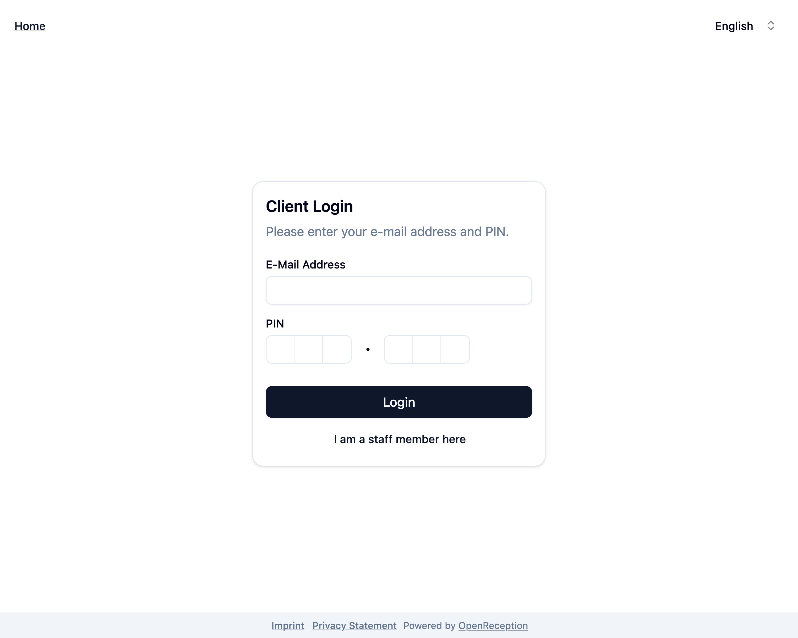

import {Steps} from "@astrojs/starlight/components";

This step-by-step guide shows you how to login into the OpenReception dashboard.

:::note
This is not the [client login](/client-side/client-dashboard)
:::

<Steps>

1. Go to your organizations appointment booking page. Click _Login_ in the top left corner.

   

1. You've been forwarded to the client login. Click _I am a staff member here_.

   

1. Now you are on the dashboard login page.

   

1. Enter your **e-mail address**

1. _Click/Tap to add passkey_ and follow the instructions in the system overlay to enter your passkey.

1. Once this is done, we will automatically try to login you in. If successfull, you are now forwarded to the dashboard.

</Steps>
