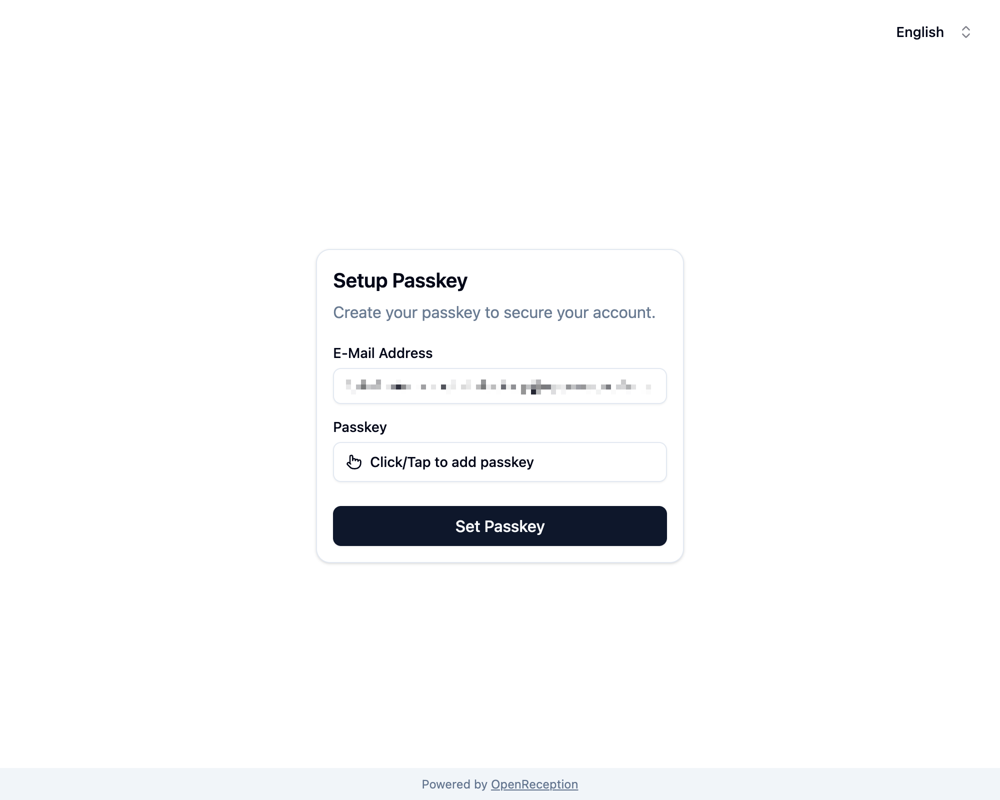
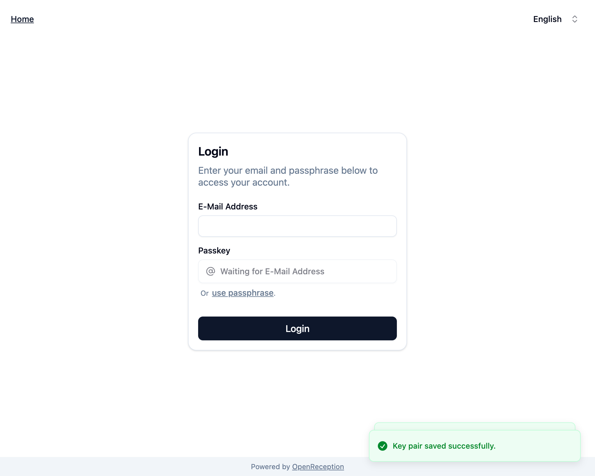

import {Steps} from "@astrojs/starlight/components";

This step-by-step guide shows you how to setup your OpenReception account, if you have been invited to an organization.

:::note
This guide requires you to have been [invited by another team member](/staff/add-staff-member) beforehand.
:::

:::caution
You will need your [PRT Passkey](/getting-started/#passkeys) at hand for this to work.
:::

<Steps>

1. You will have an e-mail with an invitiation in your inbox. Click on the link provided in that e-mail.

1. You may see an e-mail confirmation success screen.

   

   If your invitiation expired, you will see a _Verification failed_ message. You can request a new invitation link on that same page by clicking _Request new E-Mail_.

   

1. When you've confirmed your e-mail address, click _Setup Passkey_.

1. You will be forwarded to a form where you can add you passkey by clicking _Click/Tap to add passkey_.

   

1. Depending on your Passkey you will now see a system overlay that guides you through setting up your passkey for this organization. Follow the instructions.

   For **Software Passkeys** this usually includes biometric approval.

   For **Hardware Passkeys** this usually includes touching the contact area of a passkey (usually a metal surface) and entering a Passphrase/ PIN.

   If this is the first time you are using that passkey, you may also have to set a PIN/Passphrase. **Use a strong and long passphrase!**

1. Once you've set the passkey, we need to retrieve additional data to decrypt appointments. You will see a confirm dialog:

   ```
   Now use your newly created passkey to enable encryption with it.
   ```

   Click _Ok_.

1. You will be asked to verify the use of your passkey, which is similar to the process described above.

1. Once this process is done, you will see a message _Added Passkey successfully_ in the **passkey** field. Now click _Set Passkey_

   

1. You will now see two success notifications and the login form.

   

</Steps>

Your account is now set up. Your team members may still need to [grant you access to previous appointments](/staff/grant-access-to-staff-member).
