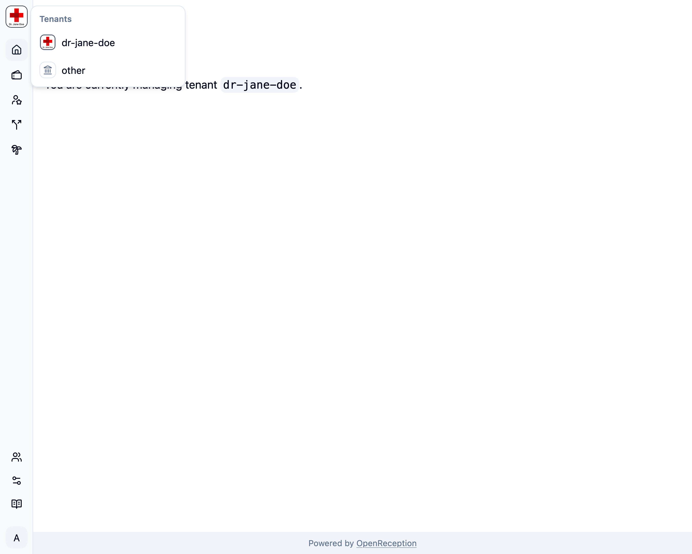

This page shows some tips for working with the OpenReception dashboard

## Dashboard Overview

The dashboard gives you access to all appointments and settings.

You can toggle the navigation sidebar large and small by clicking its border or the sidebar icon in the top left corner of the main area.

## Account Menu

You can access your personal account settings using the account menu.

This is also the place where you can safely logout.

## Tenant Switch

Global Admins can make use of the tenant switch in the top left corner. This makes switching tenants quick.

