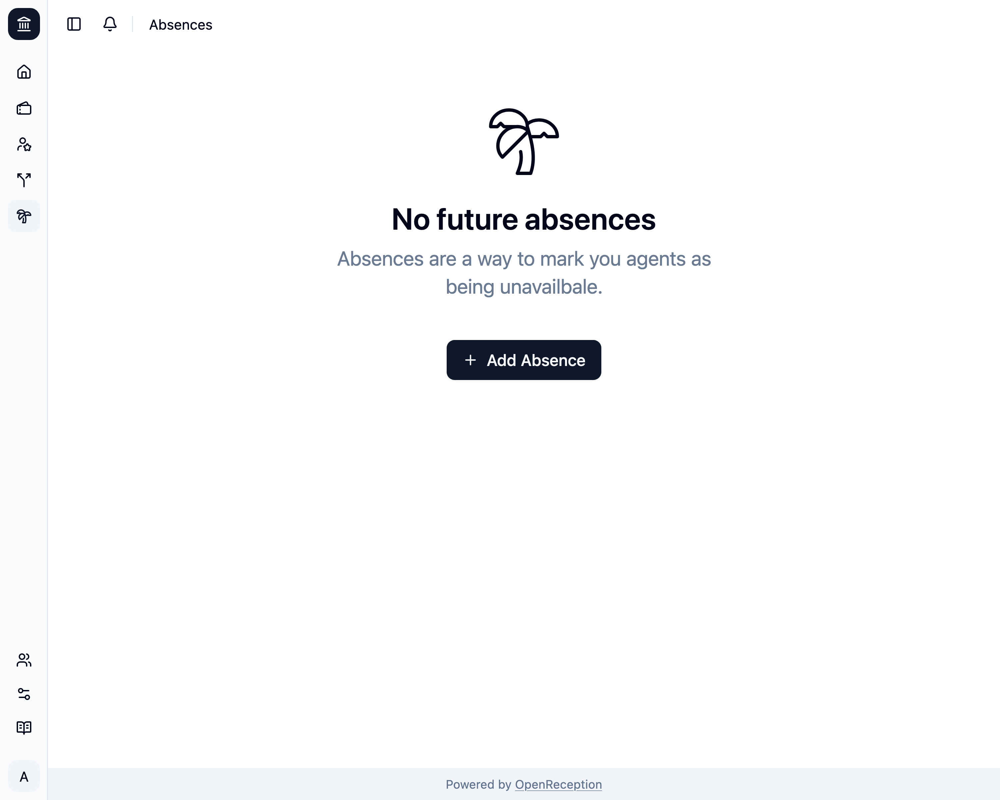

import {Steps} from "@astrojs/starlight/components";

<Steps>

1. Navigate to the absences section of the dashboard and click on _Add Absence_

   

1. A modal with a form opens.
   - Select the absent **agent**
   - Change the **reason**, if you want to track it here.
   - Select a range for the absence. The **to date** must be in the future.

   

1. Click _Add Absence_ and it will be saved.
   

</Steps>
