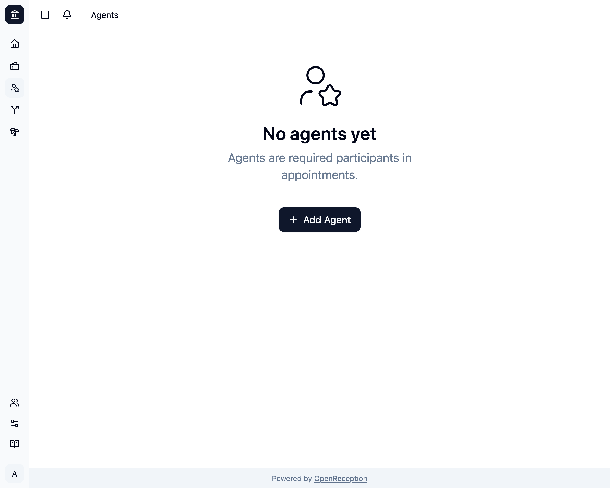
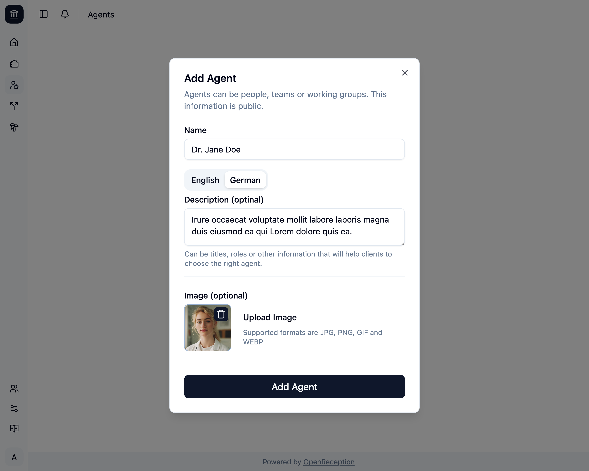

import {Steps} from "@astrojs/starlight/components";

:::note
Before you add an agent, make sure you've [set up all the tenant languages](../../settings/base-settings).
:::

<Steps>

1. Navigate to the agents section of the dashboard and click on _Add Agent_

   

1. A modal with a form opens.
   - Add a **name**
   - Add a **description**, if you want. If you've set it for one language, you'll have to set it for all languages.
   - Click _Upload Image_ to add an image for this agent.

   

1. If you've uploaded an image, you can crop it right within OpenReception. Click _Apply_, when you're happy with your selection.

   

1. Then click _Add Agent_ and it will be saved.
   

</Steps>
