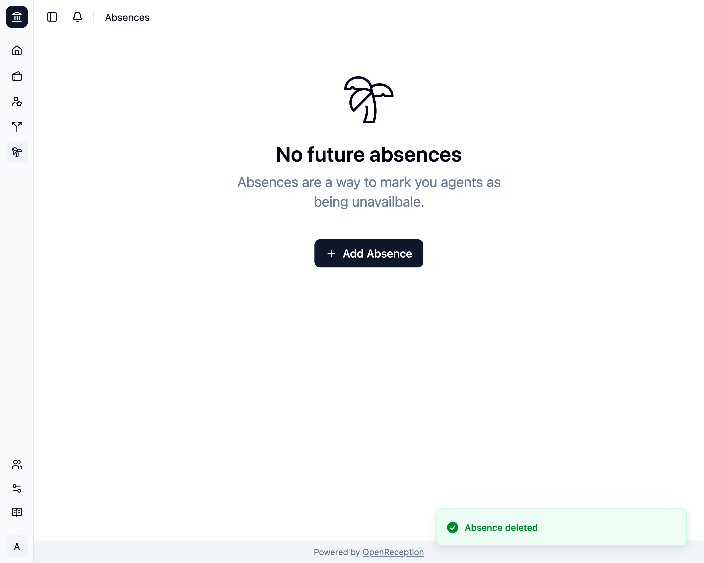

import {Steps} from "@astrojs/starlight/components";

<Steps>

1. Navigate to the absences section of the dashboard, search for the absence you want to delete and open the context menu for it. Click on _Delete_.

   

1. A modal opens. Click _Delete Absence_

   

1. The absence will be removed.

   

</Steps>
