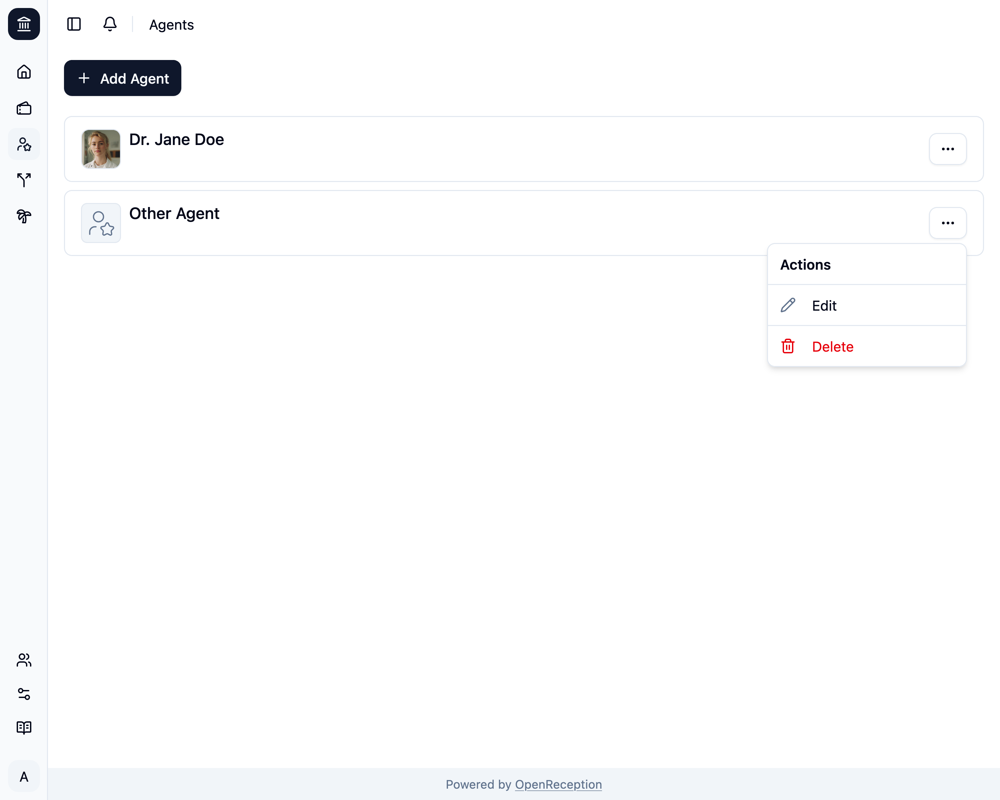
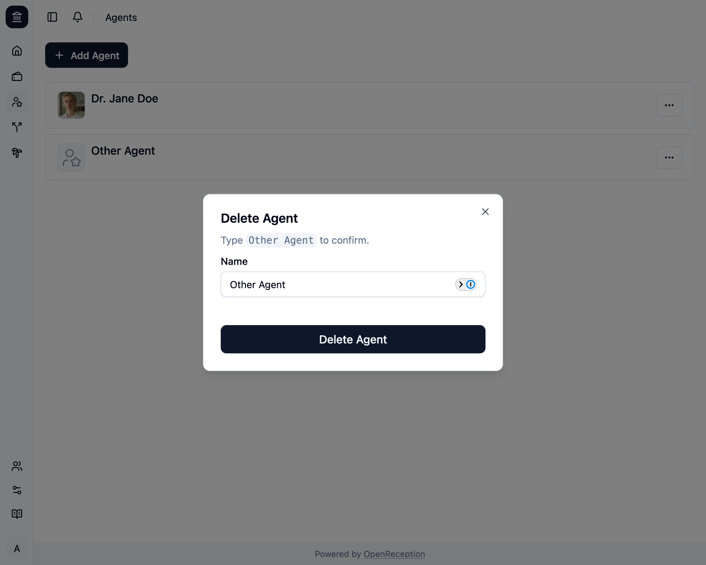

import {Steps} from "@astrojs/starlight/components";

<Steps>

1. Navigate to the agents section of the dashboard, search for the agent you want to delete and open the context menu for it. Click on _Delete_.

   

1. A modal with a form opens. Enter the name of the agent and click _Delete Agent_

   

1. The agent will be removed.

   

</Steps>
