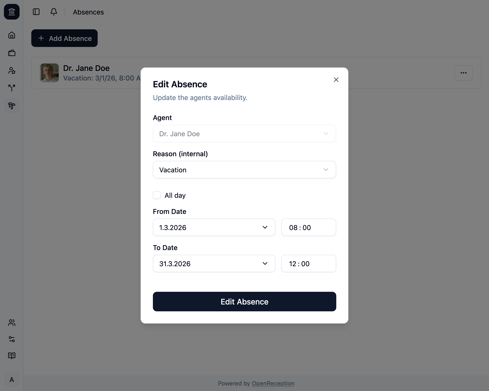

import {Steps} from "@astrojs/starlight/components";

:::note
You cannot change the agent. You must remove the absence and create a new absence with the correct agent, in that case.
:::

<Steps>

1. Navigate to the absences section of the dashboard, search for the absence you want to edit and open the context menu for it. Click on _Edit_.

   

1. A modal with a form opens.
   - Change the **reason**, if you want
   - Change the date range, if you want
   - Click _Edit Absence_ when you are finished.

   

1. The absence will be updated.

   

</Steps>
