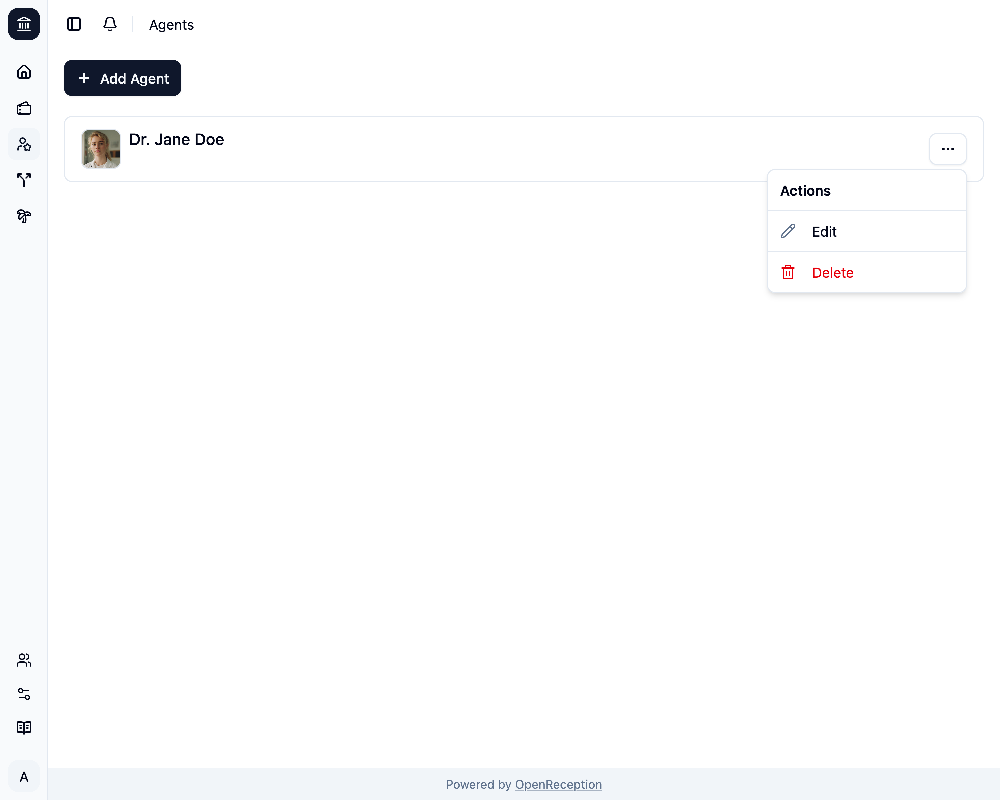
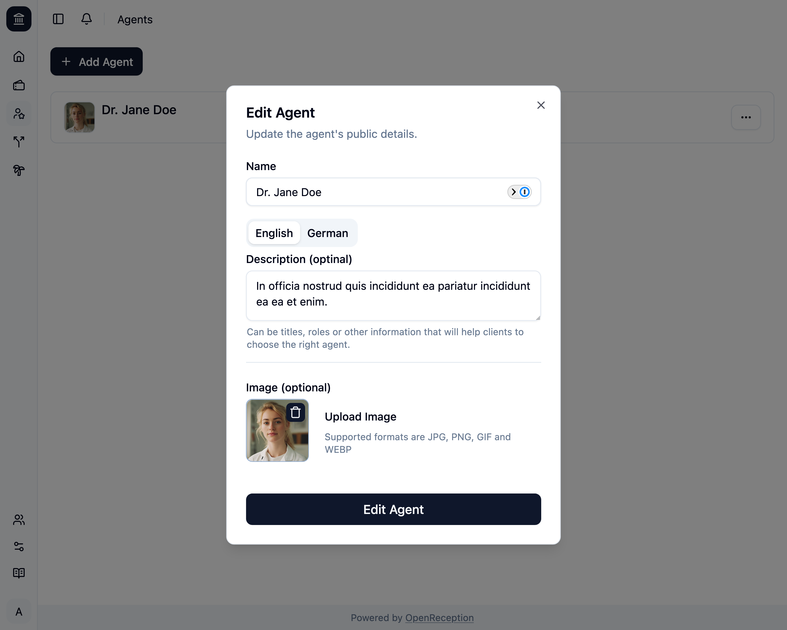

import {Steps} from "@astrojs/starlight/components";

:::note
If you use descriptions and have added languages since the last time you've edited an agent, you can only save your changes, if you add descriptions of all missing languages.
:::

<Steps>

1. Navigate to the agents section of the dashboard, search for the agent you want to edit and open the context menu for it. Click on _Edit_.

   

1. A modal with a form opens.
   - Edit the **name**
   - Edit **descriptions**, if you want.
   - Edit the **image**, if you want.
   - Click _Edit Agent_ when you are finished.

   

1. The agent will be updated.

   

</Steps>
