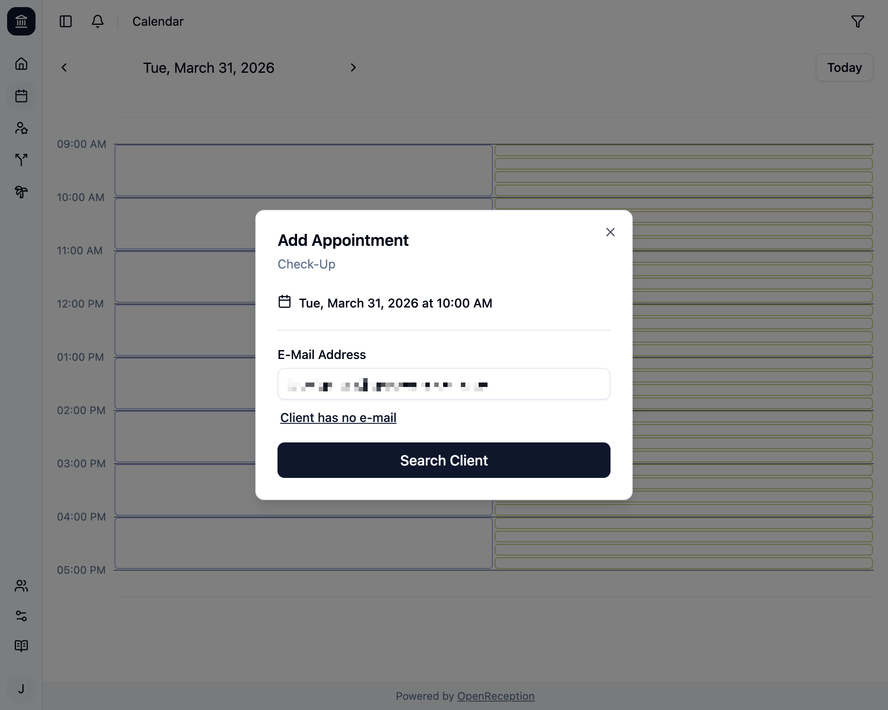
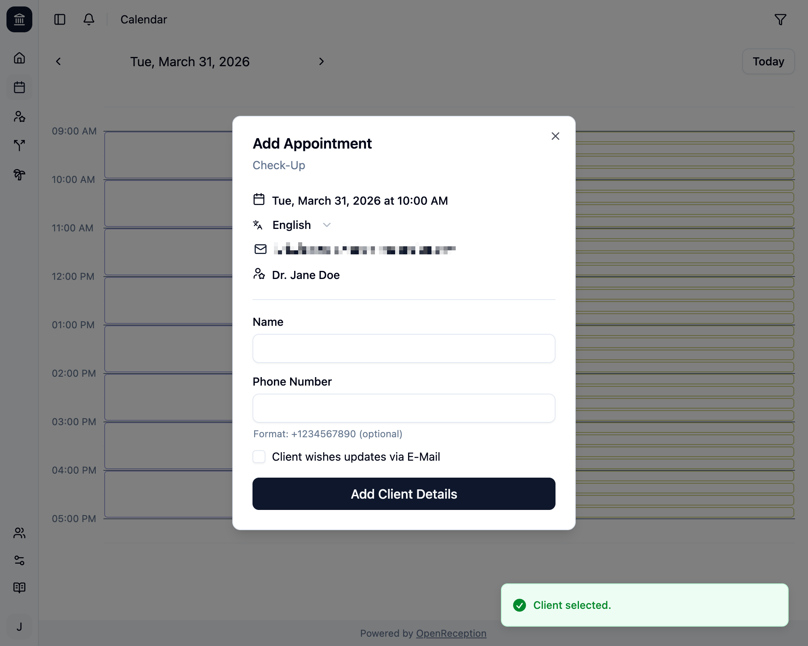
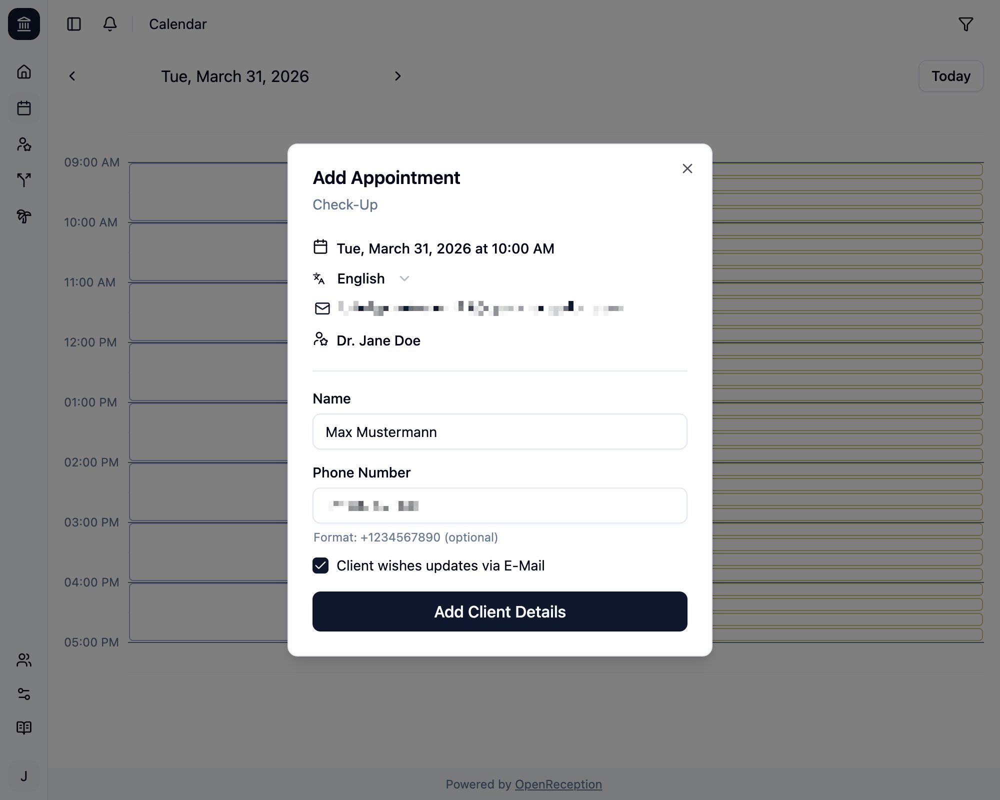
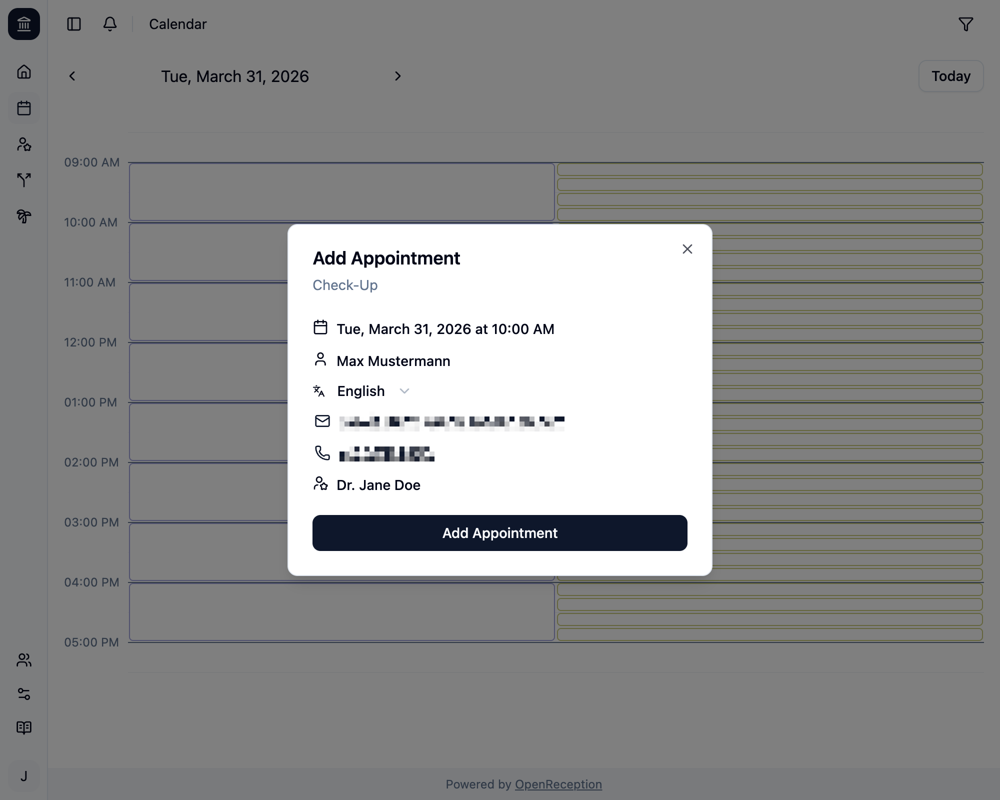
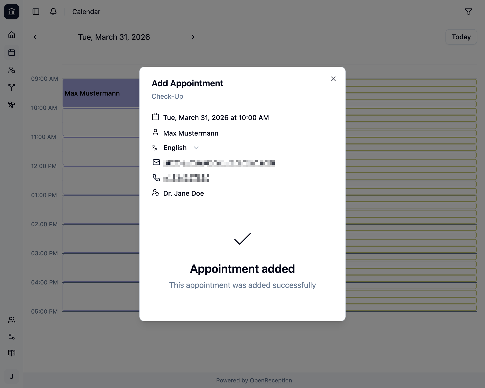

import {Steps} from "@astrojs/starlight/components";

In the calendar you can add appointments to any available slot.

To identify clients OpenReception uses e-mail addresses. If you have the e-mail address of a client and add it to the appointment, the client will be informed about changes.

But you can also add appointments for clients that don't have an e-mail address.

## Add Appointment with E-Mail Address

<Steps>

1.  Navigate to the calendar section of the dashboard, go to the date and time you wish to add an appointment to and click on the empty slot.

    

1.  A modal will open. Enter the e-mail address of the client and click _Search Client_

    

1.  If the client was found, you will see a notification that shows _Client selected_.

    

    If not, you will be asked to confirm, if you want to add this client:

    ```
    This client does not have an account yet. Do you want to create an account for them?
    ```

    Click _Ok_ to add the client or _Cancel_ to try with another e-mail address.

1.  Either way you will be asked to enter appointment details.
    - Add a **name**
    - Add a **phone number**, if you want
    - Check the checkbox, if the client want's updates via e-mail
    - Click _Add Client Details_

    

1.  Lastly you can review your appointment before creating it. Click _Add Appoitment_ to create it.

    

1.  You will see a success message, once the appointment was created. The modal stays open, so you can talk to you client about it.

    

    Once you close the modal, you will see the newly added appointment in the calendar.

    

</Steps>

## Add Appointment without E-Mail Address

<Steps>

1.  Navigate to the calendar section of the dashboard, go to the date and time you wish to add an appointment to and click on the empty slot.

    

1.  A modal will open. Click _Client has not e-mail_ to bypass the e-mail form.

    

1.  You will be asked to enter appointment details.
    - Add a **name**
    - Add a **phone number**, if you want
    - Click _Add Client Details_

    

1.  Lastly you can review your appointment before creating it. Click _Add Appoitment_ to create it.

    

1.  You will see a success message, once the appointment was created. The modal stays open, so you can talk to you client about it.

    

    Once you close the modal, you will see the newly added appointment in the calendar.

    

</Steps>
