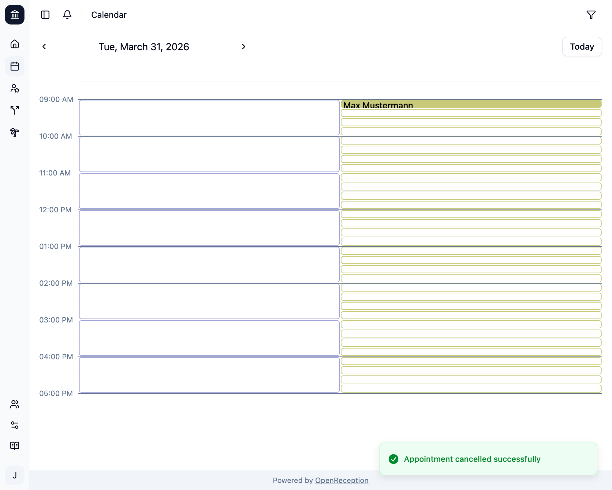

import {Steps} from "@astrojs/starlight/components";

If there is a appointment in the calendar that you want to remove, you can **cancel** it.

<Steps>

1.  Navigate to the calendar section of the dashboard, go to the appointment you wish to cancel and click on it.

    

1.  A modal with the appointment details opens. Click _Cancel Appointment_

    

1.  A confirm dialog opens.

    ```
    Are you sure you want to cancel this appointment?
    ```

    Click _Ok_ to proceed.

1.  The appointment is now removed. If the client had E-Mail notifications enabled, they wil be notified.

    

    Every staff member in the channel will be notified.

</Steps>
