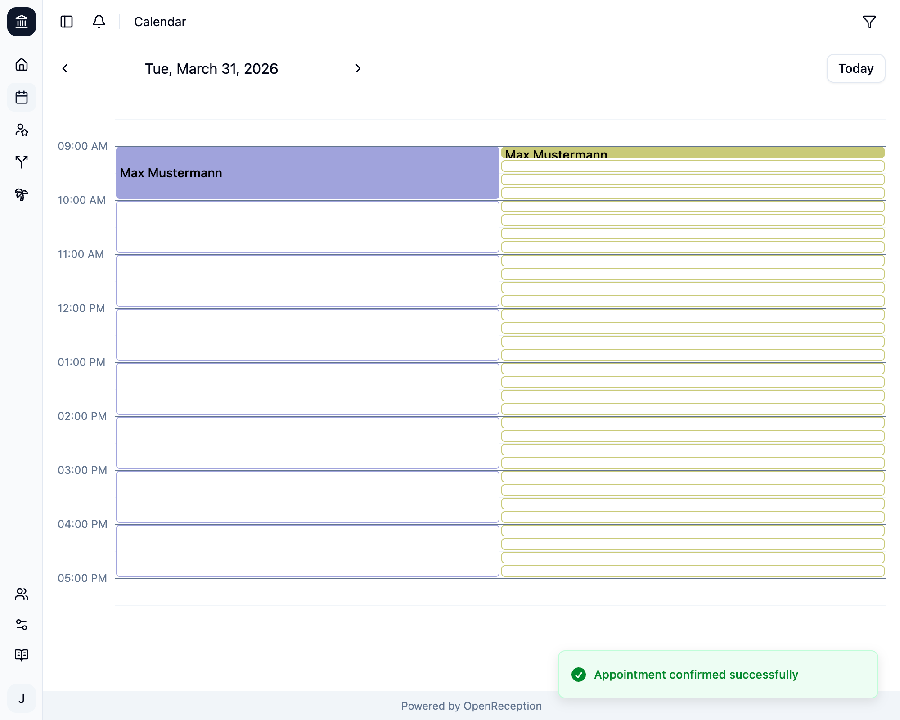

import {Steps} from "@astrojs/starlight/components";

If you've set a [channel to require confirmation](/channels#require-confirmation) before appointments are accepted, you have to confirm or [deny](/calendar/deny-appointment) them.

<Steps>

1.  Navigate to the calendar section of the dashboard, go to the appointment you wish to confirm and click on it.

    

1.  A modal with the appointment details opens. Click _Confirm Appointment_

    

1.  The appointment is now confirmed. If the client had E-Mail notifications enabled, they wil be notified.

    

    Every staff member in the channel will be notified.

</Steps>
