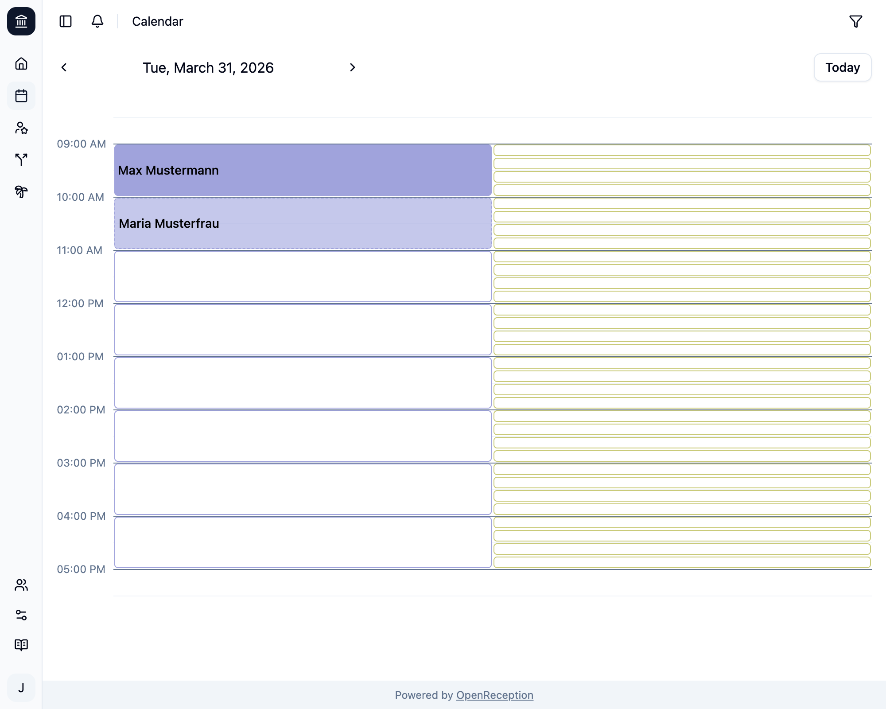
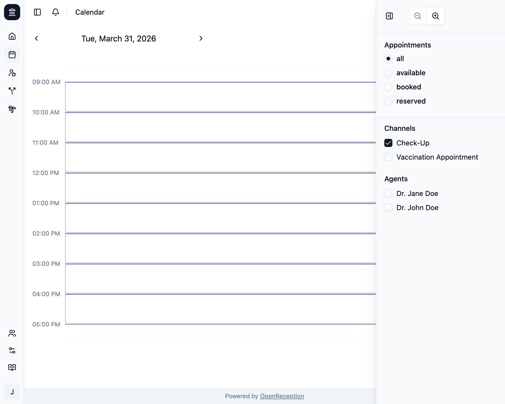
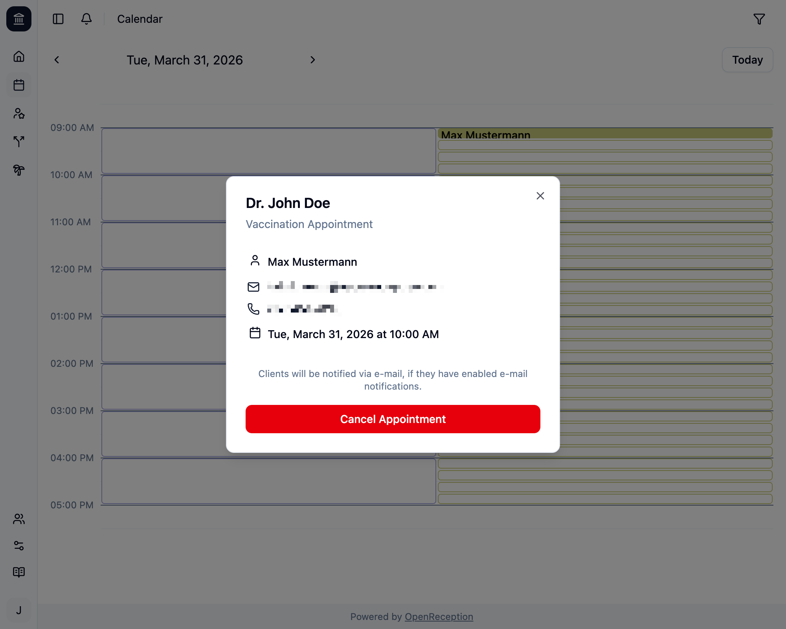

The OpenReception calendar page shows you all appointments and available slots by default.

## Navigation

You can use the arrows to the left an right of the shown date to go backwards or forward in the calendar.

You can use the **Today** button to quickly jump to the current date.

## Slots & Appointments

Each channel has their own color. Colors are assigned by default.

- **Available slots** have a transparent background and a border.
- **Booked appointments** have a background and show the name of the client.
- **Requested appointments** have a semi-transparent background, a dashed border and show the name of the client.

Hours without appointments or available slots are automatically hidden.

## Filters & Zoom

Open the settings bar by clicking on the filter icon in the top right corner. On larger screen this filter bar is always shown.

You can filter by **appointment availability**, **channel** and **agent**. This allows you to look at todays schedule (for any agent or channel) and seach for the next available slot.

Using the **channel** filter will only show appointments and slots for the respective channel.

Using the **agents** filter will only show appointments and slots with this agent.

All filters can be combined.

You may also change the **calendar zoom** so it fit's your slot duration best.

## Appointment Details

When clicking on an appointment a modal will open and show the details for this appointment.

Clicking on the E-Mail Address will automatically open your E-Mail application.

Clicking on the Phone Number will automatically start a call, if you have a phone app installed on your device.

