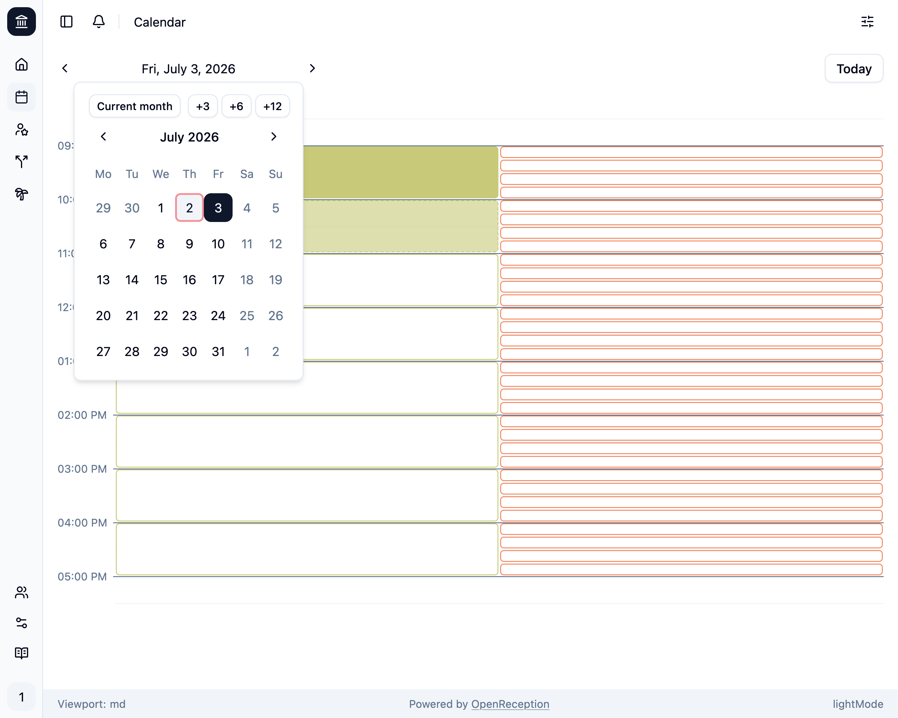
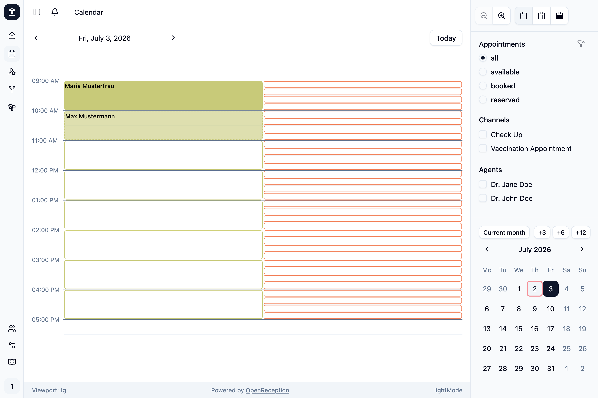
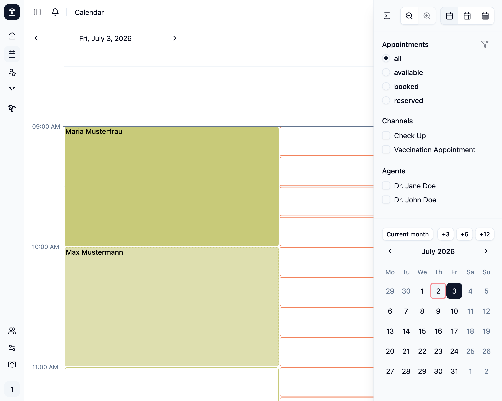
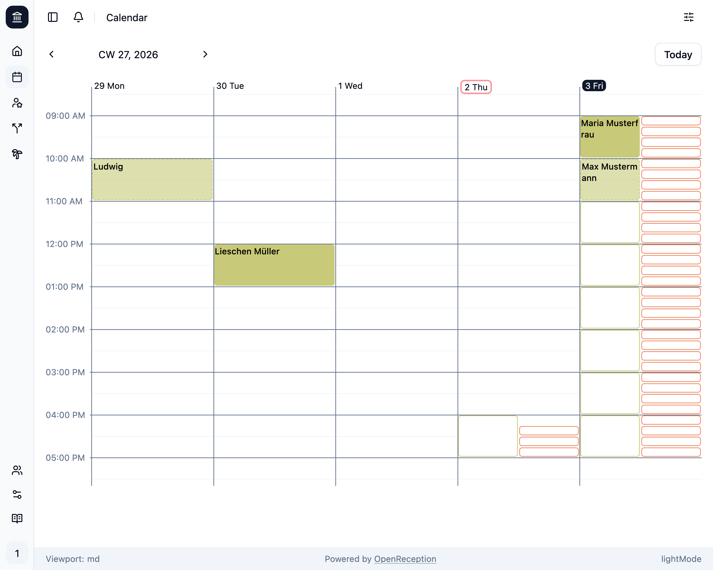
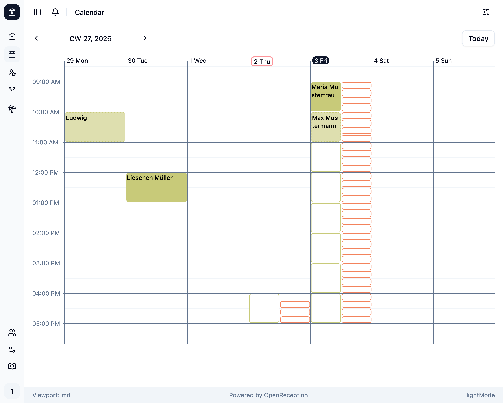
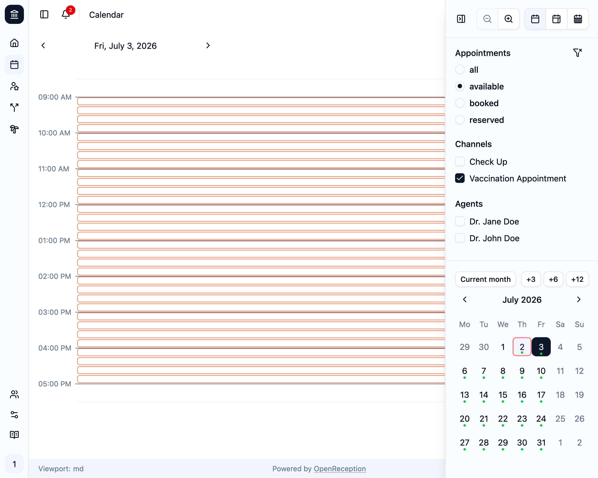
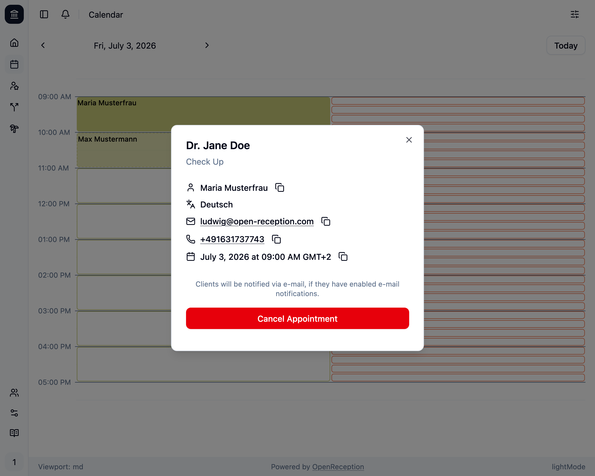

The OpenReception calendar page shows you all appointments and available slots by default.

## Navigation

You can use the arrows to the left an right of the shown date to go backwards or forward in the calendar.

You can use the **Today** button to quickly jump to the current date.

You can use the [Quick Navigation](#quick-navigation) feature to quickly jump to any date in the past or future. The [sidebar](#sidebar) also has a small calendar for quick navigation.

## Slots & Appointments

Each channel has their own color. Colors are assigned by default.

- **Available slots** have a transparent background and a border.
- **Booked appointments** have a background and show the name of the client.
- **Requested appointments** have a semi-transparent background, a dashed border and show the name of the client.

Hours without appointments or available slots are automatically hidden.

## Quick Navigation

If you click on the date (or calendar week) shown between the navigation arrows at the top left, a small calendar will open. You can use this to quickly jump to any date in the past or future.

Active filters are also reflected here as described in the [filters](#filters) section below.

## Sidebar

The calendar sidebar shows display options, filters and another quick navigation calendar. On smaller screens this sidebar is hidden by default and can be opened by clicking the **filter** button in the top right corner. On larger screens this sidebar is always visible.

## Zoom

The zoom feature allows you to see even the shortest appointments in a larger view. This is especially useful if you have a lot of appointments in a short timeframe.

You can change the zoom inside the sidebar. It will be remembered for your next visits.

## Week Views

The week view allows you to see the entire week at once. This is especially useful if you want to have a broad overview of your appointments and available slots.

You can change the view inside the sidebar. It will be remembered for your next visits.

There is a week view that shows only the working days (Monday to Friday) and a week view that shows all days of the week (Monday to Sunday).

## Filters

Open the sidebar by clicking on the filter icon in the top right corner. On larger screen this filter bar is always shown.

You can filter by **appointment availability**, **channel** and **agent**. This allows you to look at todays schedule (for any agent or channel) and seach for the next available slot.

:::note
When filtering the month overviews in the sidebar and the quick navigation will show green dots on dates that match your filter criteria. This allows you to quickly jump to the relevant dates.
:::

Using the **channel** filter will only show appointments and slots for the respective channel.

Using the **agents** filter will only show appointments and slots with this agent.

All filters can be combined.

## Appointment Details

When clicking on an appointment a modal will open and show the details for this appointment.

You can copy any personal data by clicking the copy-button behind it. This allows you to quickly search for this person in any other application.

Clicking on the E-Mail Address will automatically open your E-Mail application.

Clicking on the Phone Number will automatically start a call, if you have a phone app installed on your device.

