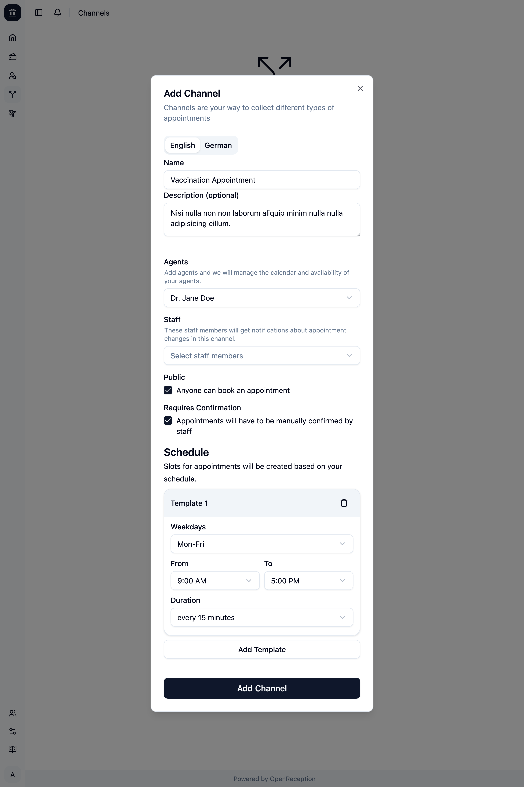
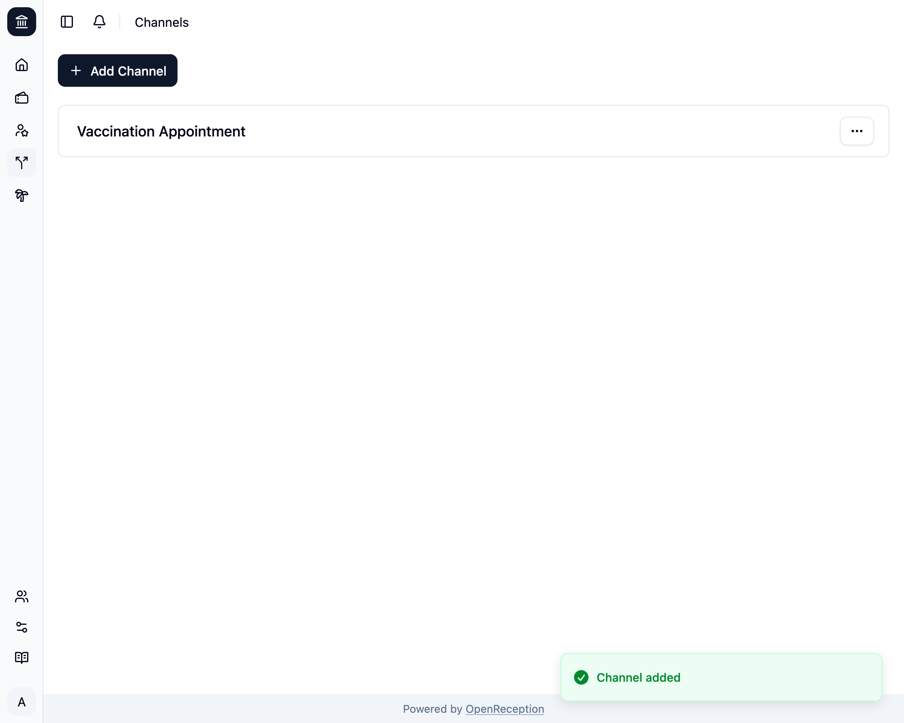

import {Steps} from "@astrojs/starlight/components";

:::note
Before you add a channel, make sure you've [set up all the tenant languages](../../settings/base-settings).
:::

<Steps>

1. Navigate to the channels section of the dashboard and click on _Add Channel_

   

1. A modal with a form opens.
   - Add a **name** and **description** in all your languages
   - Select the **agents** that can conduct appointments in this channel. When auto-secting agents they will be selected in the order you've set in this list.
   - Select the **staff members** that will get notifications about this channel (for appointment requests).
   - Select if this channel should be **public**. If It's not public, only you can book an appointment using the [calendar](../calendar)
   - Select if appointments **require confirmation**. You will be [notified by the notification system](../staff/notifications) if a new request is added.
   - Add a **schedule** for you appointments. See [slot templates](../#slot-templates).

   

1. Then click _Add Channel_ and it will be saved.
   

</Steps>
