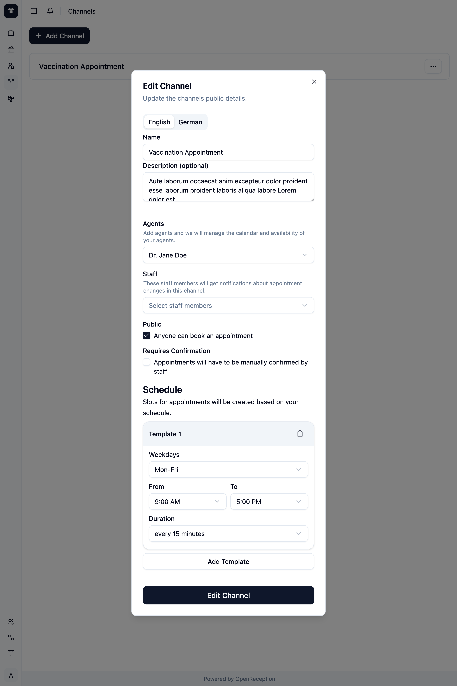

import {Steps} from "@astrojs/starlight/components";

:::note
If you use descriptions and have added languages since the last time you've edited a channel, you can only save your changes, if you add descriptions of all missing languages.
:::

<Steps>

1. Navigate to the channels section of the dashboard, search for the channel you want to edit and open the context menu for it. Click on _Edit_.

   

1. A modal with a form opens.
   - Edit the **name** and **description** in all your languages, if you want
   - Change the selection for **agents** that have to be available for an appointment in this channel.
   - Change the selection for **staff members** that will get notifications about this channel (for appointment requests).
   - Change if this channel should be **public**. If It's not public, only you can book an appointment using the [calendar](../calendar)
   - Change if appointments **require confirmation**. You will be [notified by the notification system](../staff/notifications) if a new request is added.
   - Add a **schedule** for you appointments. See [slot templates](../#slot-templates).

   

1. The channel will be updated.

   

</Steps>
