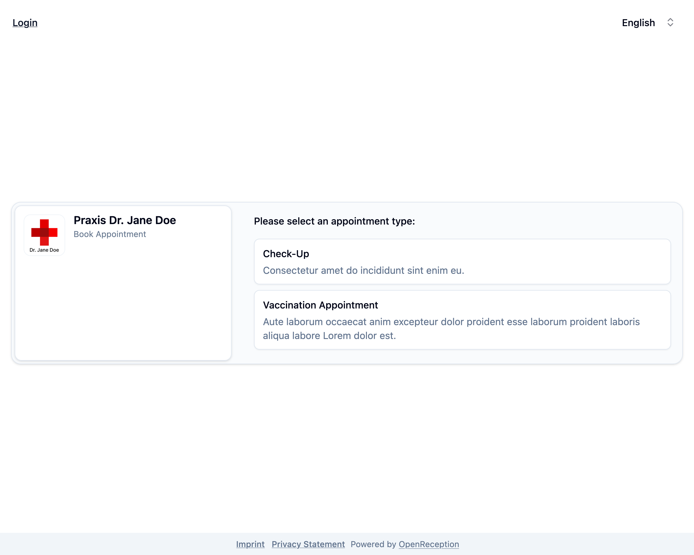
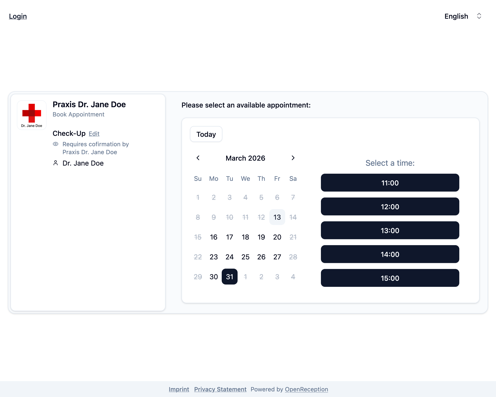
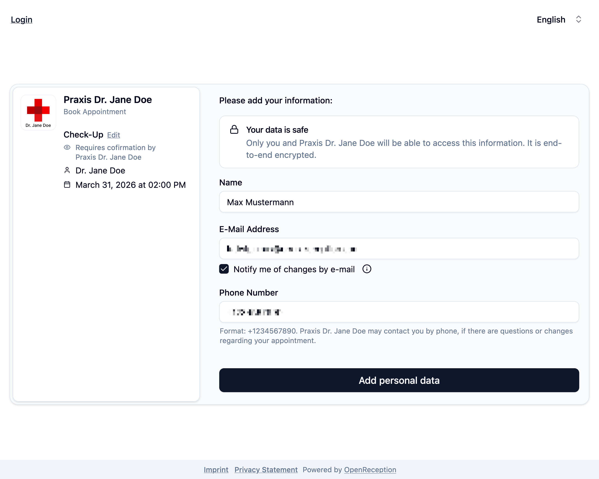
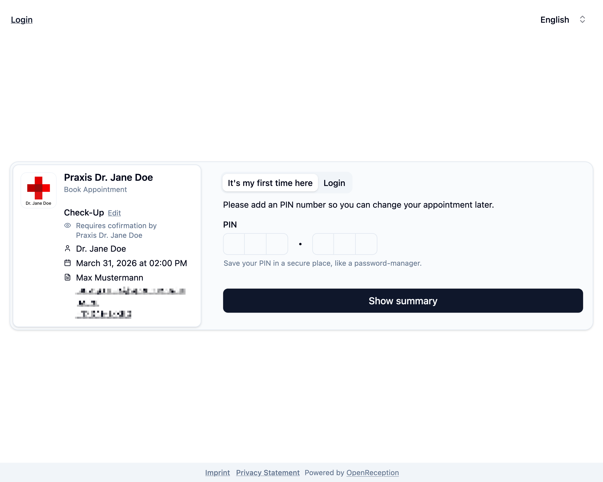
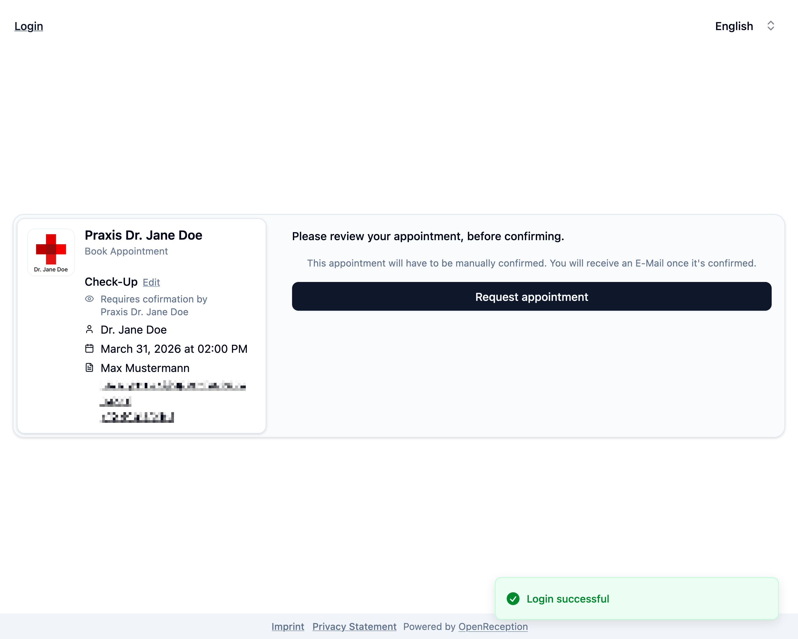
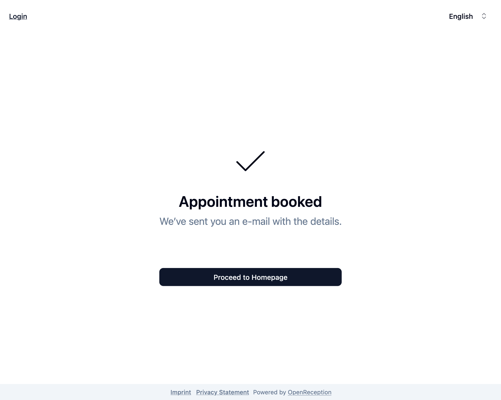
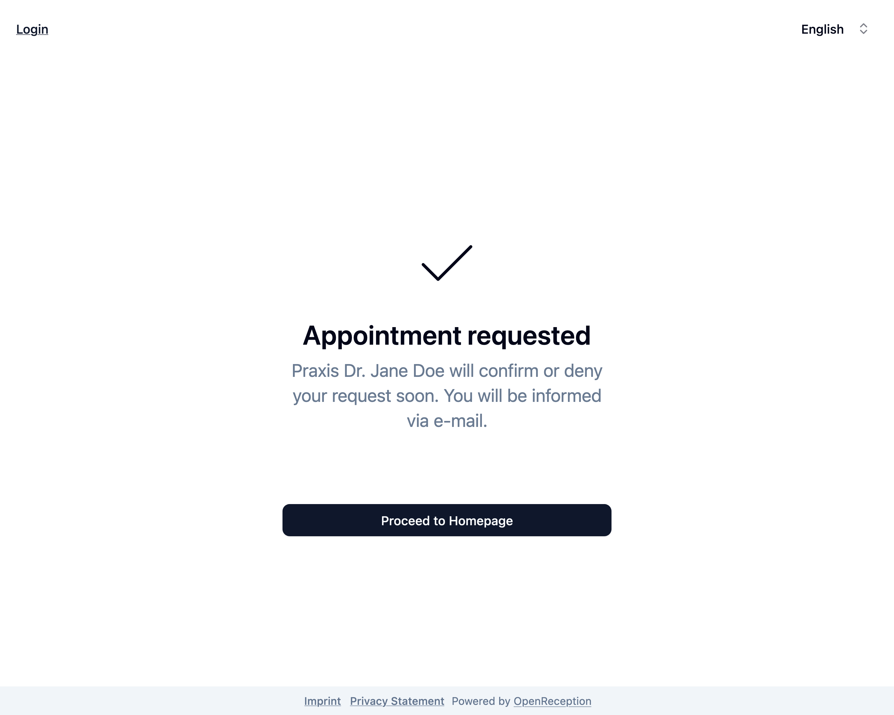

import {Steps} from "@astrojs/starlight/components";

This step-by-step guide shows you how book an appointment in OpenReception.

:::note
Some appointment types may not be booked directly. Those have to be requested first. A staff member will later [confirm](/calendar/confirm-appointment) or [deny](/calendar/deny-appointment) your request.
:::

<Steps>

1.  Navigate to the organizations appointment booking page and click on _Book Appointment_.

    

1.  Select the appointment type you want (internally we call them channels).

    

1.  Select the person you want your appointment with. This step is skipped, if only one person is available for this appointment type.

    

1.  Select an available **date** and **time** for your appointment.

    

1.  Add your personal data.
    - Add your **name**.
    - Add your **e-mail address**.
    - Check the checkbox below the e-mail address field to be **notified about changes**. If you don't check this you need to come back and [login](/client-side/client-dashboard) to manually check for changes.
    - Add your **phone number**. The organization may require you to add your phone number here.
    - Click _Add personal data_ to proceed.

    

1.  If you've booked an appointment here before select the tab _Login_ at the top.

    

1.  Enter your PIN and click _Show summary_

1.  If you've logged-in and your e-mail and PIN are correct, you will see a _Login successful_ notification.

    

1.  Check the appointment details. Click _Book appointment_ or _Request appointment_.

1.  Your appointment is now booked/requested.

    
    

</Steps>

You can now login to see the current state of your appointment.
