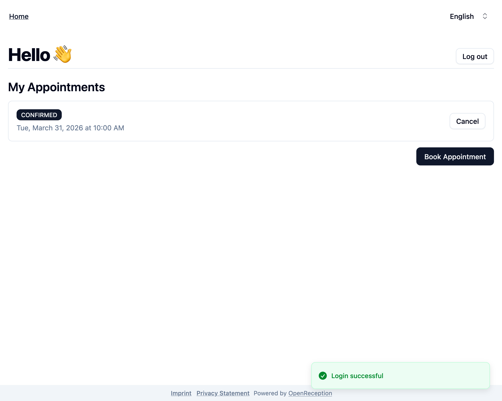
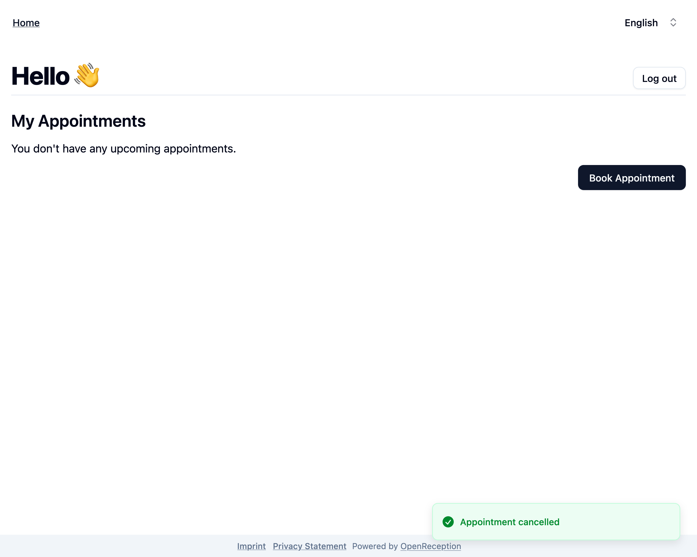

import {Steps} from "@astrojs/starlight/components";

This page guides you though all client side dashboard features.

## Login

<Steps>

1.  Navigate to the organizations appointment booking page and click _Login_ in the top left corner.

    

1.  Enter your **e-mail address** and **PIN**. Click _Login_.

    

1.  If you credential are correct, you will be forwarded to the client dashboard.

    

</Steps>

## Dashboard Overview

On the client dashboard you will see all your future appointments.

You can also safely logout.

## Cancel Appointment

You can cancel future appointments using the client dashboard.

<Steps>

1.  Navigate to your client dashboard. Search for the appointment you want to cancel and click _Cancel_ on it's tile.

    

1.  A modal will open. Click _Cancel_ to confirm.

    

1.  Your appointment is now cancelled and will be removed from the list.

    

</Steps>
