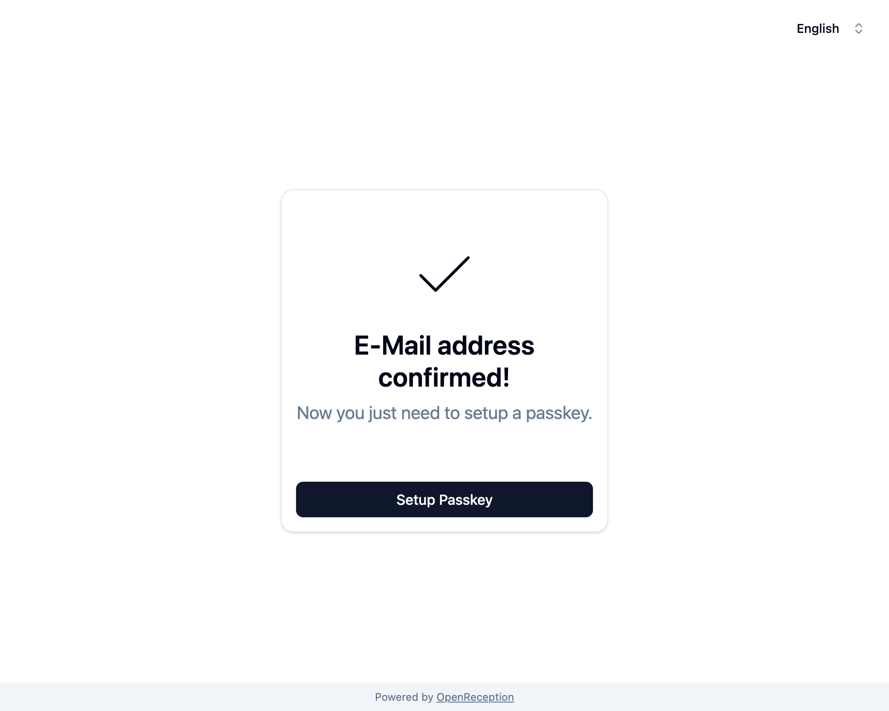
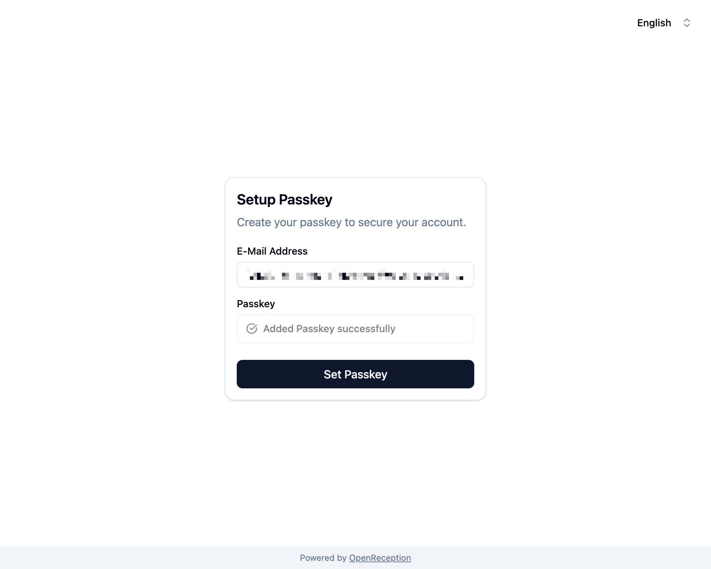

import {Steps} from "@astrojs/starlight/components";

Diese Schritt-für-Schritt-Anleitung zeigt Dir, wie Du Dein OpenReception-Konto einrichtest, wenn Du zu einer Organisation eingeladen wurdest.

:::note
Diese Anleitung erfordert, dass Du zuvor von einem anderen Teammitglied [eingeladen wurdest](/de/staff/add-staff-member).
:::

:::caution
Du wirst Deinen [PRT Passkey](/de/getting-started/#passkeys) für diese Anleitung benötigen.
:::

<Steps>

1. Du wirst eine E-Mail mit einer Einladung in Deinem Posteingang haben. Klicke auf den Link in dieser E-Mail.

1. Du wirst möglicherweise einen Erfolgsmeldung für die E-Mail-Bestätigung sehen.

   

   Falls Deine Einladung abgelaufen ist, wirst Du eine _Bestätigung fehlgeschlagen_-Meldung sehen. Du kannst auf derselben Seite einen neuen Einladungslink anfordern, indem Du auf _E-Mail erneut senden_ klickst.

   

1. Wenn Du Deine E-Mail-Adresse bestätigt hast, klicke auf _Passkey einrichten_.

1. Du wirst zu einem Formular weitergeleitet, in dem Du Deinen Passkey hinzufügen kannst, indem Du auf _Tippe um Passkey hinzuzufügen_ klickst.

   

1. Je nachdem welchen Passkey Du verwendest wird nun ein Systemfenster angezeigt, das Dich durch die Einrichtung Deines Passkeys für diese Seite führt. Folge den Anweisungen.

   Bei **Software Passkeys** ist in der Regel eine biometrische Genehmigung erforderlich.

   Bei **Hardware Passkeys** ist in der Regel das Berühren des Kontaktbereichs eines Passkeys (normalerweise eine Metalloberfläche) und die Eingabe einer Passphrase/PIN erforderlich.

   Falls Du diesen Passkey zum ersten Mal verwendest, musst Du möglicherweise auch eine PIN/Passphrase festlegen. **Verwende eine starke und lange Passphrase!**

1. Sobald Du Deinen Passkey eingerichtet hast, müssen wir zusätzliche Daten abrufen, um Termine zu entschlüsseln. Du siehst ein Bestätigungsfenster:

   ```
   Jetzt verwende den neu erstellten Passkey, um damit die Verschlüsselung zu aktivieren.
   ```

   Bestätige mit _Ok_.

1. Du wirst aufgefordert die Verwendung Deines Passkeys zu bestätigen. Dieser Vorgang ähnelt dem oben beschriebenen Prozess.

1. Sobald dieser Vorgang abgeschlossen ist, wird _Passkey hinzugefügt_ im **Passkey-Feld** angezeigt. Klicke jetzt auf _Passkey hinzufügen_

   

1. Die siehst jetzt zwei Benachrichtigungen für das Erfolgreiche Setzen des Passkeys. Das Anmeldeformular wird angezeigt.

   

</Steps>

Dein Konto ist jetzt eingerichtet. Deine Kolleg:innen müssen evtl. noch den [Zugriff auf bereits bestehende Daten von Klient:innen freigeben](/de/staff/grant-access-to-staff-member).
