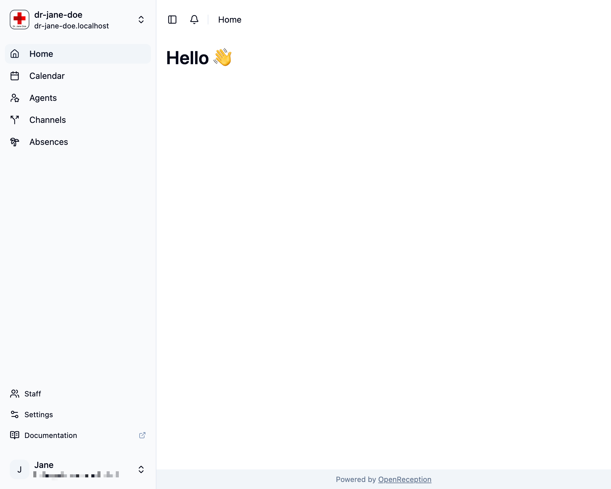
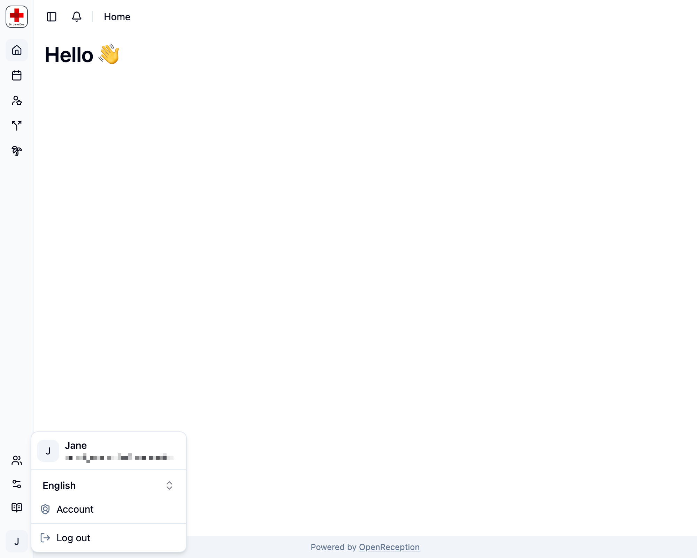

Diese Seite zeigt einige Tipps zum Arbeiten mit dem OpenReception-Dashboard

## Dashboard-Übersicht

Das Dashboard gibt Dir Zugriff auf alle Termine und Einstellungen.

Du kannst die Navigations-Seitenleiste vergrößern und verkleinern, indem Du deren Rand oder das Seitenlisten-Symbol in der oberen linken Ecke des Hauptbereichs klickst.

## Kontomenü

Du kannst auf Deine persönlichen Kontoeinstellungen über das Kontomenü zugreifen.

Dies ist auch der Ort, an dem Du Dich sicher abmelden kannst.

## Mandantenwechsel

Globale Admins können den Mandantenwechsel in der oberen linken Ecke nutzen. Dies macht das Wechseln zwischen Mandanten schnell.

