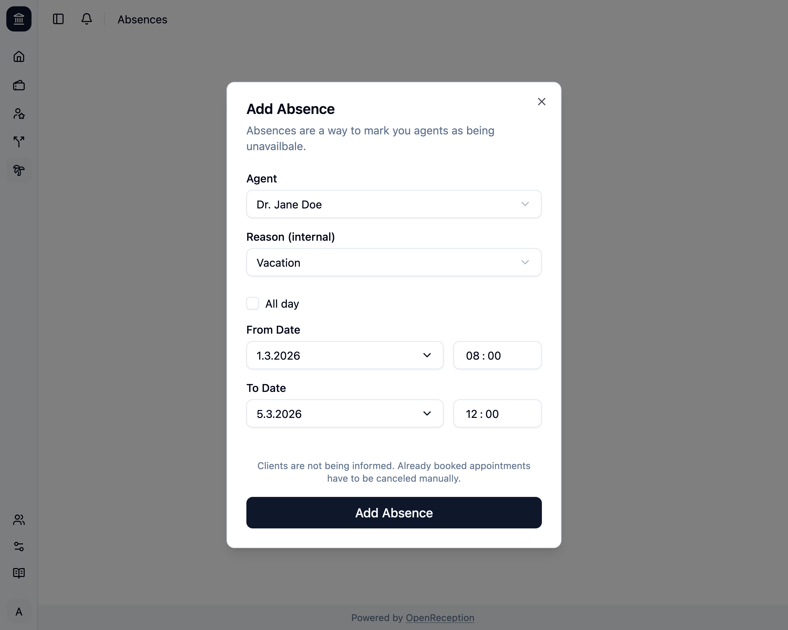
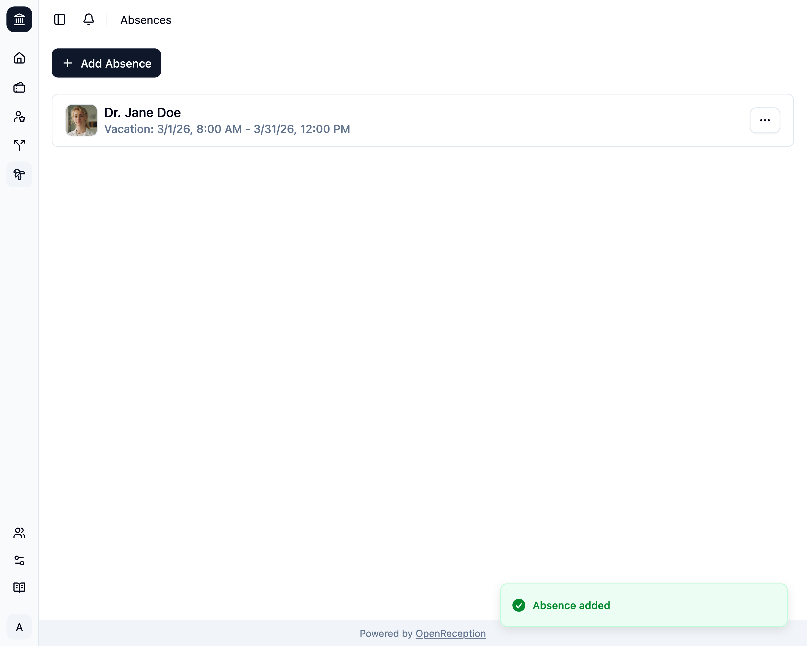

import {Steps} from "@astrojs/starlight/components";

<Steps>

1. Navigiere zum Abschnitt Abwesenheiten des Dashboards und klicke auf _Abwesenheit hinzufügen_

   

1. Ein Modal mit einem Formular wird geöffnet.
   - Wähle die abwesende **Akteur:in**
   - Ändere den **Grund**, wenn Du ihn hier verfolgen möchtest.
   - Wähle einen Zeitbereich für die Abwesenheit. Das **Enddatum** muss in der Zukunft liegen.

   

1. Klicke auf _Abwesenheit hinzufügen_ und es wird gespeichert.
   

</Steps>
