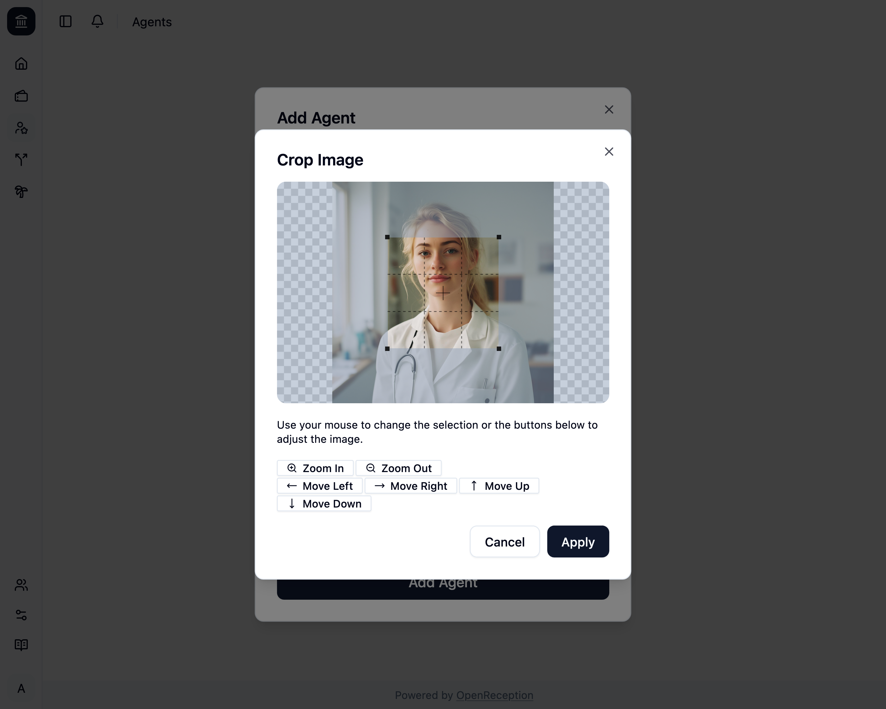
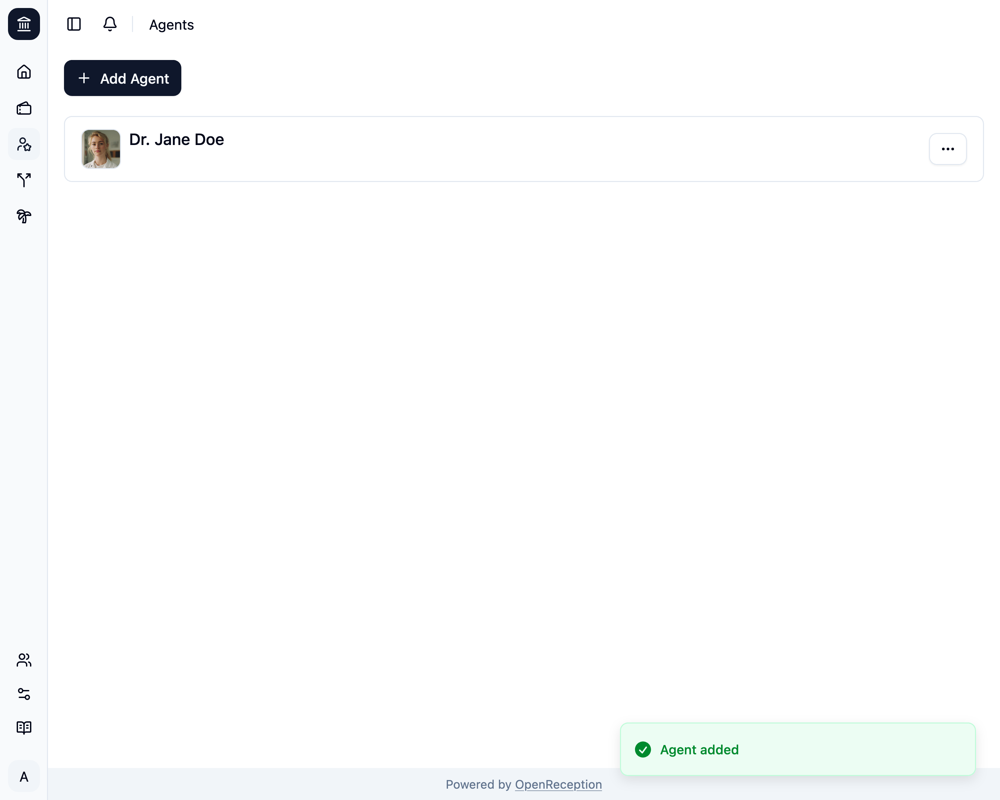

import {Steps} from "@astrojs/starlight/components";

:::note
Bevor Du einen/eine Akteur:in hinzufügst, stelle sicher, dass Du [alle Mandanten-Sprachen eingerichtet](../../settings/base-settings) hast.
:::

<Steps>

1. Navigiere zum Abschnitt Akteure des Dashboards und klicke auf _Akteur:in hinzufügen_

   

1. Ein Modal mit einem Formular wird geöffnet.
   - Füge einen **Namen** hinzu
   - Füge eine **Beschreibung** hinzu, wenn Du möchtest. Wenn Du sie für eine Sprache gesetzt hast, musst Du sie auch für alle anderen Sprachen setzen.
   - Klicke auf _Bild hochladen_, um ein Bild für diese Akteur:in hinzuzufügen.

   

1. Wenn Du ein Bild hochgeladen hast, kannst Du es direkt in OpenReception zuschneiden. Klicke auf _Übernehmen_, wenn Du zufrieden mit Deiner Auswahl bist.

   

1. Klicke dann auf _Akteur:in hinzufügen_ und es wird gespeichert.
   

</Steps>
