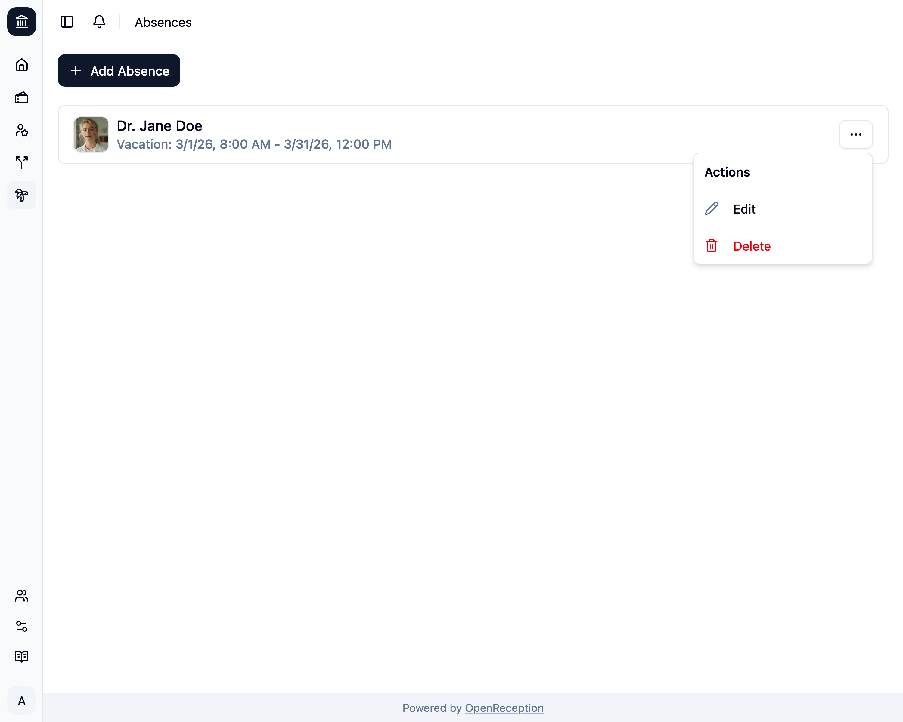
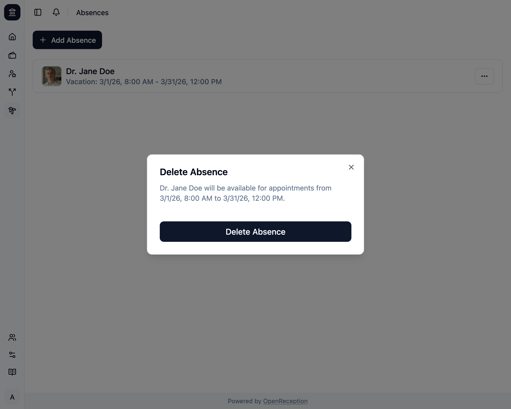

import {Steps} from "@astrojs/starlight/components";

<Steps>

1. Navigiere zum Abschnitt Abwesenheiten des Dashboards, suche nach der Abwesenheit, die Du löschen möchtest, und öffne das Kontextmenü dafür. Klicke auf _Löschen_.

   

1. Ein Modal wird geöffnet. Klicke auf _Abwesenheit löschen_

   

1. Die Abwesenheit wird entfernt.

   

</Steps>
