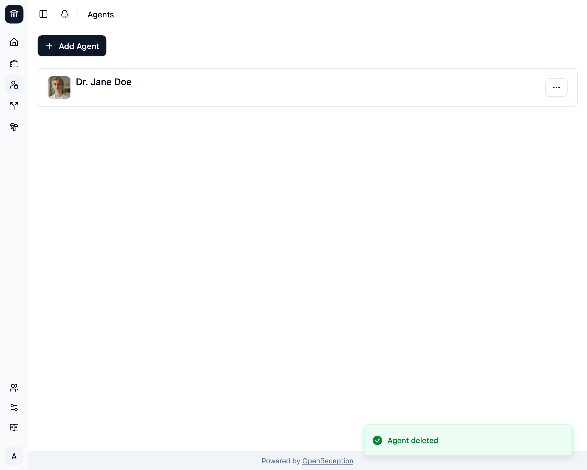

import {Steps} from "@astrojs/starlight/components";

<Steps>

1. Navigiere zum Abschnitt Akteure des Dashboards, suche nach der Akteur:in, die Du löschen möchtest, und öffne das Kontextmenü dafür. Klicke auf _Löschen_.

   

1. Ein Modal mit einem Formular wird geöffnet. Gib den Namen der Akteur:in ein und klicke auf _Akteur:in löschen_

   

1. Die Akteur:in wird entfernt.

   

</Steps>
