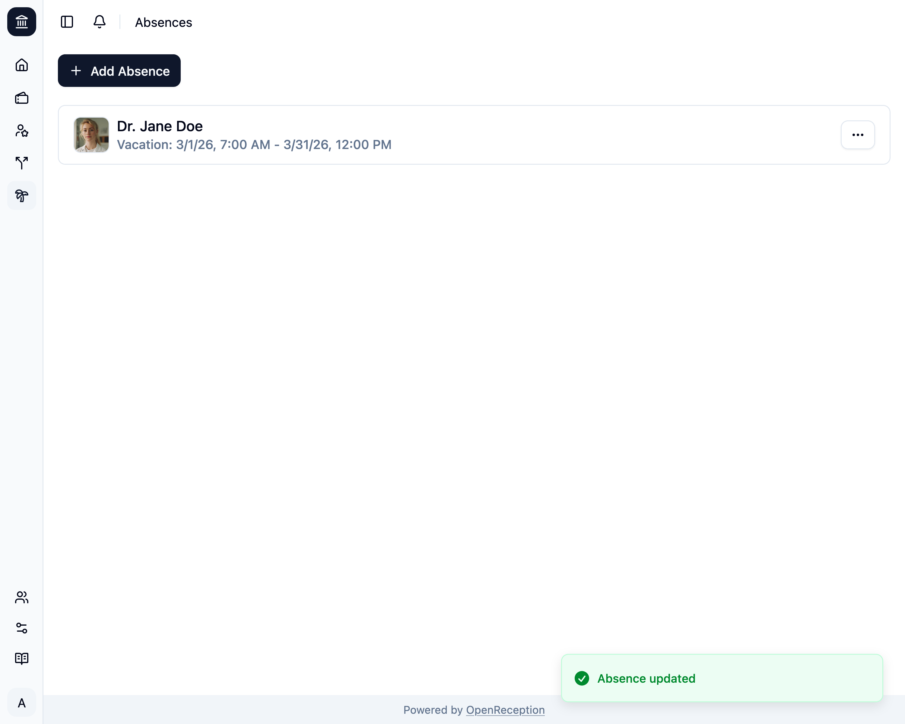

import {Steps} from "@astrojs/starlight/components";

:::note
Du kannst die Akteur:in nicht ändern. Du musst die Abwesenheit entfernen und eine neue Abwesenheit mit der korrekten Akteur:in erstellen, in diesem Fall.
:::

<Steps>

1. Navigiere zum Abschnitt Abwesenheiten des Dashboards, suche nach der Abwesenheit, die Du bearbeiten möchtest, und öffne das Kontextmenü dafür. Klicke auf _Bearbeiten_.

   

1. Ein Modal mit einem Formular wird geöffnet.
   - Ändere den **Grund**, wenn Du möchtest
   - Ändere den Zeitbereich, wenn Du möchtest
   - Klicke auf _Übernehmen_, wenn Du fertig bist.

   

1. Die Abwesenheit wird aktualisiert.

   

</Steps>
