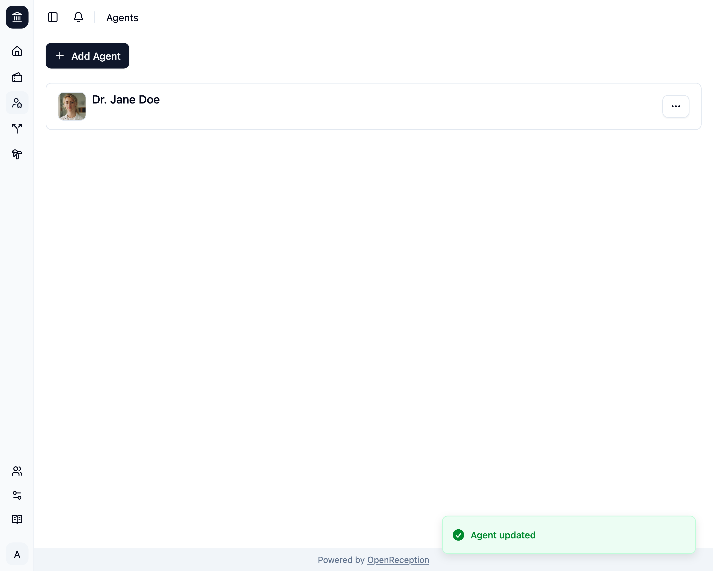

import {Steps} from "@astrojs/starlight/components";

:::note
Wenn Du Beschreibungen verwendest und seit der letzten Bearbeitung einer Akteur:in Sprachen hinzugefügt hast, kannst Du Deine Änderungen nur speichern, wenn Du Beschreibungen aller fehlenden Sprachen hinzufügst.
:::

<Steps>

1. Navigiere zum Abschnitt Akteure des Dashboards, suche nach der Akteur:in, die Du bearbeiten möchtest, und öffne das Kontextmenü dafür. Klicke auf _Bearbeiten_.

   

1. Ein Modal mit einem Formular wird geöffnet.
   - Bearbeite den **Namen**
   - Bearbeite **Beschreibungen**, wenn Du möchtest.
   - Bearbeite das **Bild**, wenn Du möchtest.
   - Klicke auf _Übernehmen_, wenn Du fertig bist.

   

1. Die Akteur:in wird aktualisiert.

   

</Steps>
