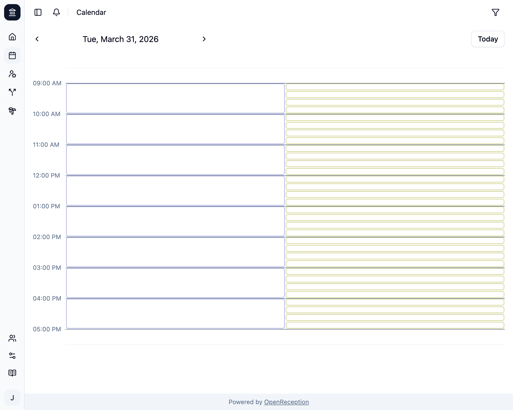
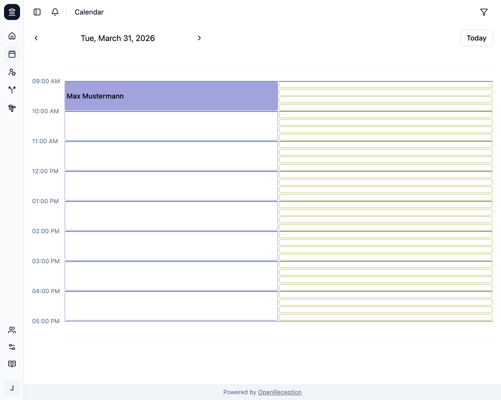
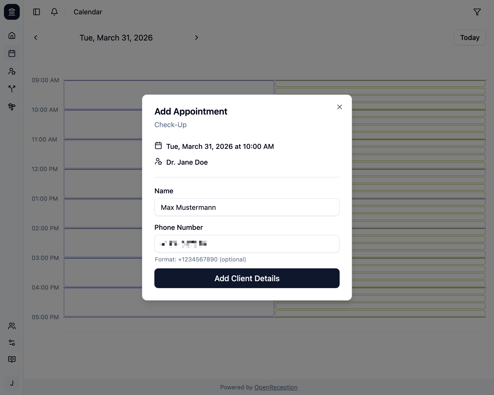
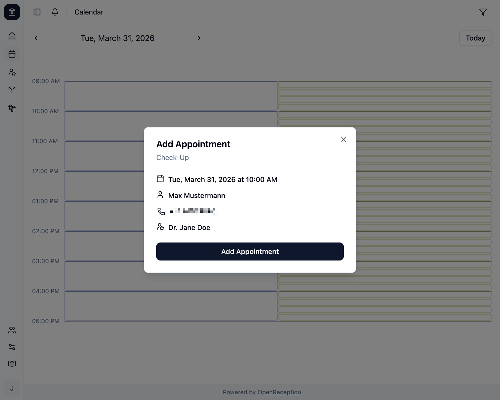
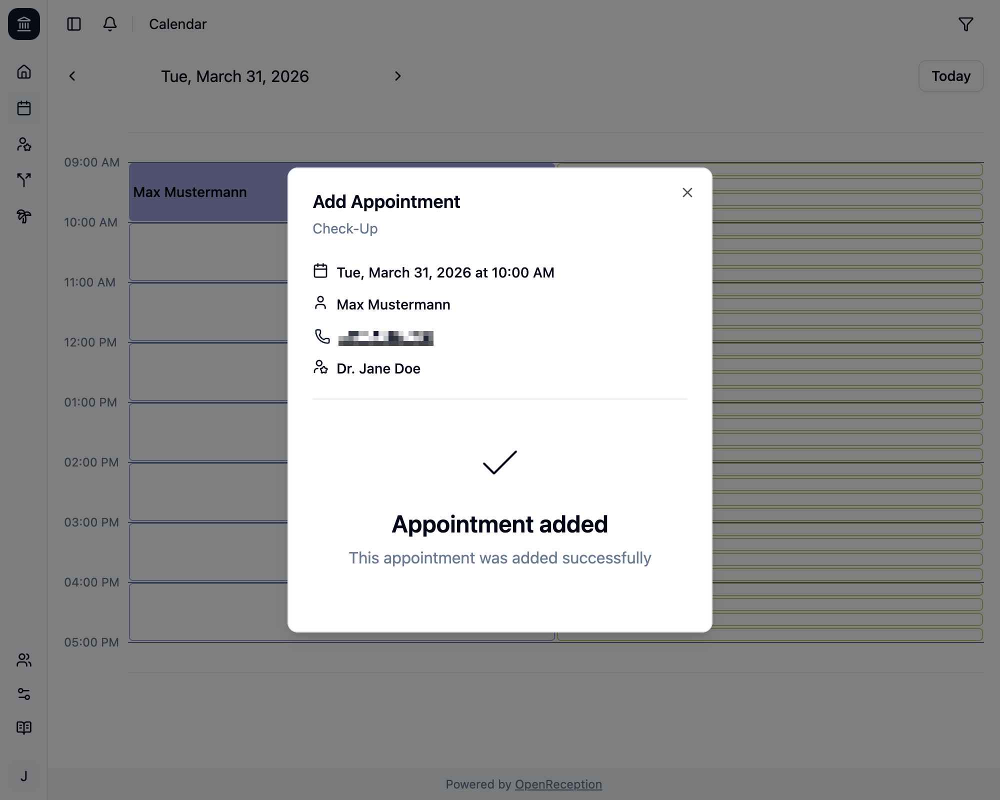

import {Steps} from "@astrojs/starlight/components";

Im Kalender kannst Du Termine zu jedem verfügbaren Zeitfenster hinzufügen.

Um Klienten:innen zu identifizieren, verwendet OpenReception E-Mail-Adressen. Wenn Du die E-Mail-Adresse einer Klient:in hast und sie zum Termin hinzufügst, wird die Klient:in über Änderungen benachrichtigt.

Du kannst aber auch Termine für Klienten:innen hinzufügen, die keine E-Mail-Adresse haben.

## Termin mit E-Mail-Adresse hinzufügen

<Steps>

1.  Navigiere zum Kalenderabschnitt des Dashboards, gehe zu dem Datum und der Uhrzeit, zu der Du einen Termin hinzufügen möchtest, und klicke auf das leere Zeitfenster.

    

1.  Ein Modal wird geöffnet. Gib die E-Mail-Adresse der Klient:in ein und klicke auf _Klient:in suchen_

    

1.  Wenn die Klient:in gefunden wurde, siehst Du eine Benachrichtigung, die "Klient:in ausgewählt".

    

    Wenn nicht, wirst Du gefragt, ob Du diese Klient:in hinzufügen möchtest:

    ```
    Diese Klient:in hat noch kein Konto. Möchten Sie ein Konto erstellen?
    ```

    Klicke auf _Ok_, um die Klient:in hinzuzufügen, oder auf _Abbrechen_, um es mit einer anderen E-Mail-Adresse zu versuchen.

1.  Auf jeden Fall wirst Du aufgefordert, Termindetails einzugeben.
    - Füge einen **Namen** hinzu
    - Füge eine **Telefonnummer** hinzu, wenn Du möchtest
    - Setze das Häckchen für **Benachrichtigungen**, wenn die Klient:in Benachrichtigungen per E-Mail wünscht
    - Klicke auf _Daten hinzufügen_

    

1.  Zum Abschluss kannst Du Deinen Termin überprüfen, bevor Du ihn erstellst. Klicke auf _Termin hinzufügen_, um ihn zu erstellen.

    

1.  Du siehst eine Erfolgsmeldung, sobald der Termin erstellt wurde. Das Modal bleibt geöffnet, sodass Du mit der Klient:in darüber sprechen kannst.

    

    Wenn Du das Modal schliesst, siehst Du den neu hinzugefügten Termin im Kalender.

    

</Steps>

## Termin ohne E-Mail-Adresse hinzufügen

<Steps>

1.  Navigiere zum Kalenderabschnitt des Dashboards, gehe zu dem Datum und der Uhrzeit, zu der Du einen Termin hinzufügen möchtest, und klicke auf das leere Zeitfenster.

    

1.  Ein Modal wird geöffnet. Klicke auf _Klient:in hat keine E-Mail_, um das E-Mail-Formular zu Überspringen.

    

1.  Du wirst aufgefordert, Termindetails einzugeben.
    - Füge einen **Namen** hinzu
    - Füge eine **Telefonnummer** hinzu, wenn Du möchtest
    - Klicke auf _Daten hinzufügen_

    

1.  Zum Abschluss kannst Du Deinen Termin überprüfen, bevor Du ihn erstellst. Klicke auf _Termin hinzufügen_, um ihn zu erstellen.

    

1.  Du siehst eine Erfolgsmeldung, sobald der Termin erstellt wurde. Das Modal bleibt geöffnet, sodass Du mit Deiner Klient:in darüber sprechen kannst.

    

    Wenn Du das Modal schliesst, siehst Du den neu hinzugefügten Termin im Kalender.

    

</Steps>
