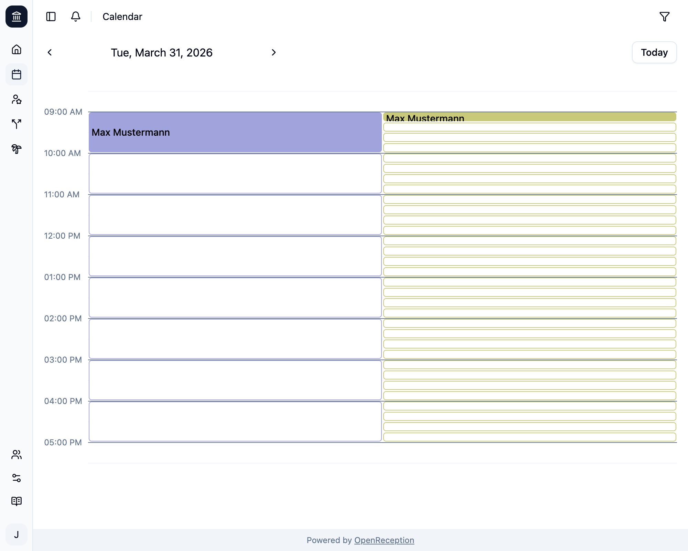
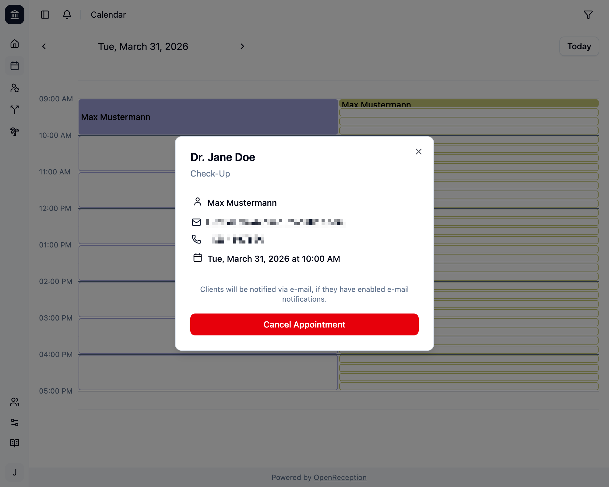

import {Steps} from "@astrojs/starlight/components";

Wenn Du einen Termin im Kalender hast, den Du entfernen möchtest, kannst Du ihn **absagen**.

<Steps>

1.  Navigiere zum Kalenderabschnitt des Dashboards, gehe zu dem Termin, den Du absagen möchtest, und klicke darauf.

    

1.  Ein Modal mit den Termindetails wird geöffnet. Klicke auf _Termin absagen_

    

1.  Ein Bestätigungsdialog wird geöffnet.

    ```
    Sind Sie sicher, dass Sie diesen Termin absagen möchten?
    ```

    Klicke auf _Ok_, um fortzufahren.

1.  Der Termin wird nun entfernt. Wenn die Klient:in E-Mail-Benachrichtigungen aktiviert hat, wird eine Benachrichtigung versendet.

    

    Jeder Mitarbeiter:in im Kanal wird benachrichtigt.

</Steps>
