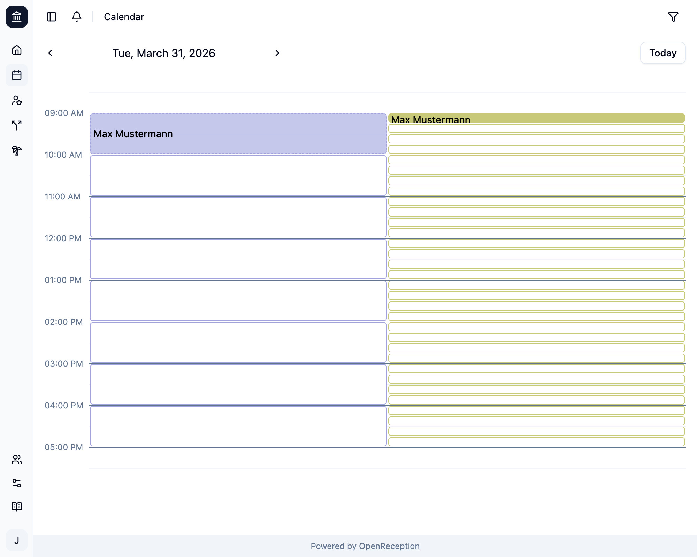
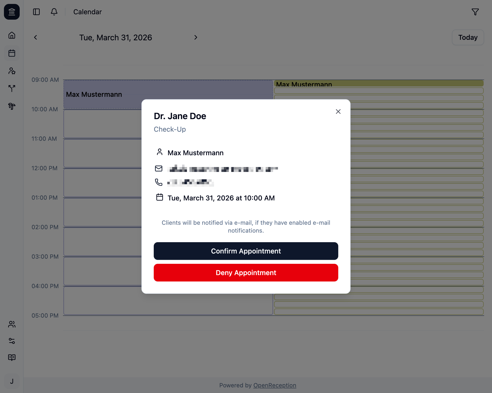

import {Steps} from "@astrojs/starlight/components";

Wenn Du einen [Kanal so eingerichtet hast, dass eine Bestätigung erforderlich ist](/de/channels#bestätigung-erforderlich), bevor Termine angenommen werden, musst Du sie bestätigen oder [ablehnen](/de/calendar/deny-appointment).

<Steps>

1.  Navigiere zum Kalenderabschnitt des Dashboards, gehe zu dem Termin, den Du bestätigen möchtest, und klicke darauf.

    

1.  Ein Modal mit den Termindetails wird geöffnet. Klicke auf _Termin bestätigen_

    

1.  Der Termin ist nun bestätigt. Wenn die Klient:in E-Mail-Benachrichtigungen aktiviert hatte, wird eine Benachrichtigung versendet.

    

    Jeder Mitarbeiter:in im Kanal wird benachrichtigt.

</Steps>
