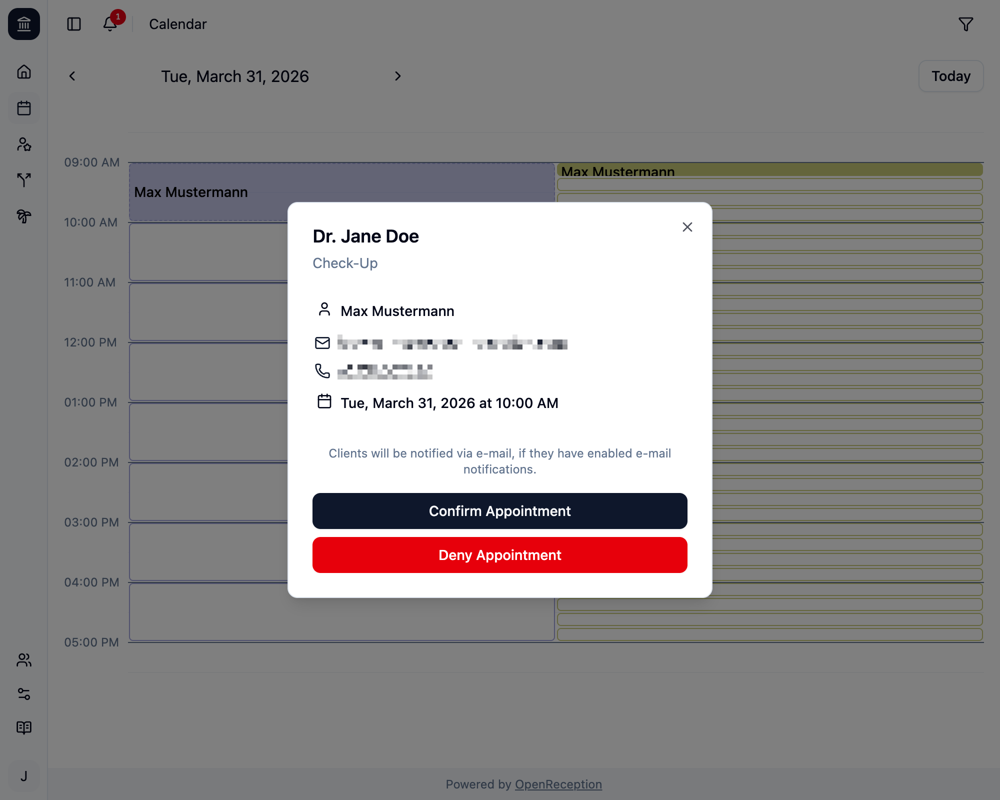
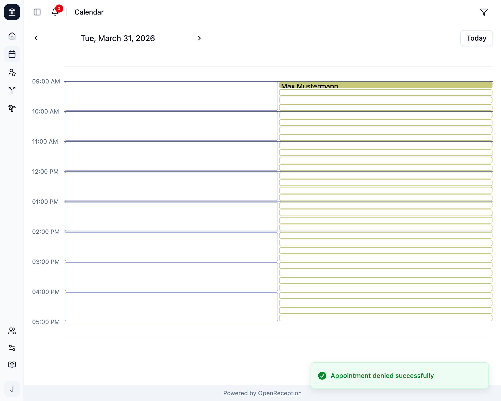

import {Steps} from "@astrojs/starlight/components";

Wenn Du einen [Kanal so eingerichtet hast, dass eine Bestätigung erforderlich ist](/de/channels#bestätigung-erforderlich), bevor Termine angenommen werden, musst Du sie [bestätigen](/de/calendar/confirm-appointment) oder ablehnen.

<Steps>

1.  Navigiere zum Kalenderabschnitt des Dashboards, gehe zu dem Termin, den Du ablehnen möchtest, und klicke darauf.

    

1.  Ein Modal mit den Termindetails wird geöffnet. Klicke auf _Termin ablehnen_

    

1.  Ein Bestätigungsdialog wird geöffnet.

    ```
    Sind Sie sicher, dass Sie diesen Termin absagen möchten?
    ```

    Klicke auf _Ok_, um fortzufahren.

1.  Der Termin wird nun abgelehnt und entfernt. Wenn die Klient:in E-Mail-Benachrichtigungen aktiviert hatte, wird eine Benachrichtigung versendet.

    

</Steps>
