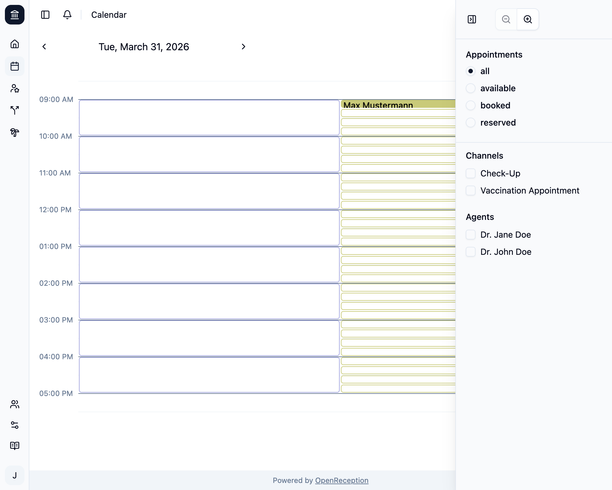
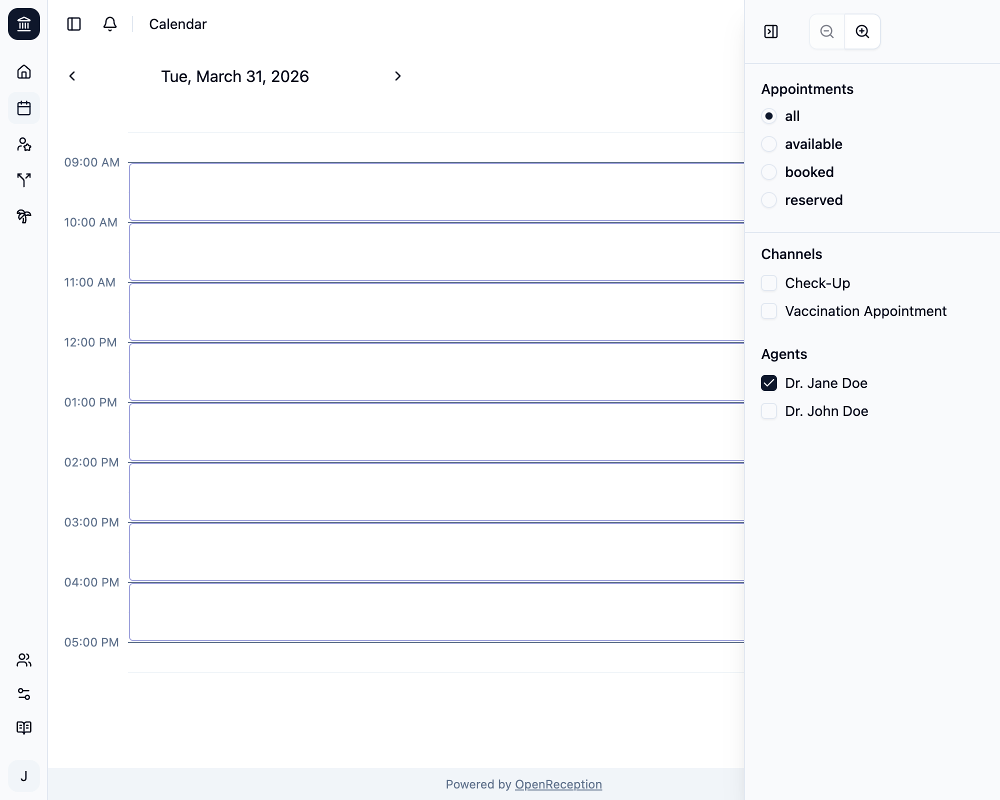

Die OpenReception Kalenderseite zeigt Dir standardmäßig alle Termine und verfügbaren Zeitfenster an.

## Navigation

Du kannst die Pfeile links und rechts neben dem angezeigten Datum verwenden, um im Kalender vor- oder zurückzugehen.

Du kannst die Schaltfläche **Heute** verwenden, um schnell zum aktuellen Datum zu springen.

## Zeitfenster & Termine

Jeder Kanal hat seine eigene Farbe. Farben werden automatisch zugewiesen.

- **Verfügbare Zeitfenster** haben einen transparenten Hintergrund und einen farbigen Rand.
- **Gebuchte Termine** haben einen Hintergrund und zeigen den Namen der Klient:in.
- **Angefragte Termine** haben einen halbdurchsichtigen Hintergrund, einen gestrichelten Rand und zeigen den Namen der Klient:in.

Stunden ohne Termine oder verfügbare Zeitfenster werden automatisch ausgeblendet.

## Filter & Zoom

Öffne die Einstellungsleiste, indem Du auf das Filtersymbol in der oberen rechten Ecke klickst. Auf größeren Bildschirmen wird diese Filterleiste immer angezeigt.

Du kannst nach **Terminverfügbarkeit**, **Kanal** und **Akteur:in** filtern. Dies ermöglicht es Dir, den Tagesplan anzusehen (für jede Akteur:in oder Kanal) und nach dem nächsten verfügbaren Termin zu suchen.

Die Verwendung des **Kanal**-Filters zeigt nur Termine und Zeitfenster für den jeweiligen Kanal an.

Die Verwendung des **Akteur**-Filters zeigt nur Termine und Zeitfenster mit dieser Akteur:in an.

Alle Filter können kombiniert werden.

Du kannst auch den **Kalender-Zoom** anpassen, damit er am besten zur Länge Deiner Zeitfenster passt.

## Termindetails

Wenn Du auf einen Termin klickst, wird ein Modal geöffnet und zeigt die Details für diesen Termin an.

Wenn Du auf die E-Mail-Adresse klickst, wird Deine E-Mail-Anwendung automatisch geöffnet.

Wenn Du auf die Telefonnummer klickst, wird automatisch ein Anruf gestartet, wenn Du eine Telefon-App auf Deinem Gerät installiert hast.

