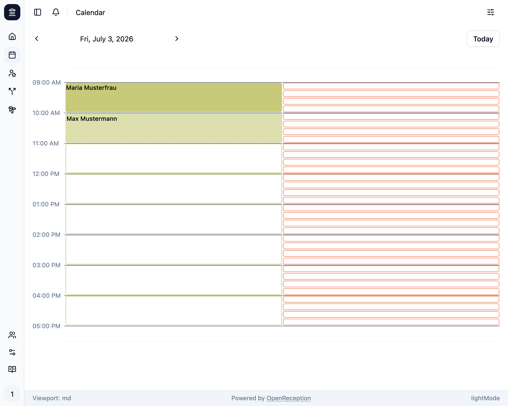
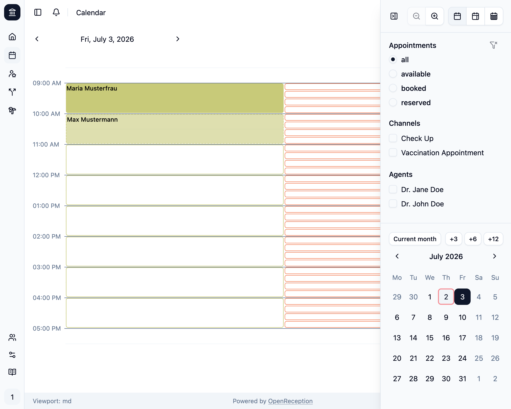

Die OpenReception Kalenderseite zeigt Dir standardmäßig alle Termine und verfügbaren Zeitfenster an.

## Navigation

Du kannst die Pfeile links und rechts neben dem angezeigten Datum verwenden, um im Kalender vor- oder zurückzugehen.

Du kannst die Schaltfläche **Heute** verwenden, um schnell zum aktuellen Datum zu springen.

Du kannst die [Schnell-Navigation](#schnell-navigation) nutzen um zu jedem Datum in der Vergangenheit oder Zukunft zu springen. Die [Seitenleiste](#seitenleiste) enthält ebenfalls einen kleinen Kalender für die Schnell-Navigation.

## Zeitfenster & Termine

Jeder Kanal hat seine eigene Farbe. Farben werden automatisch zugewiesen.

- **Verfügbare Zeitfenster** haben einen transparenten Hintergrund und einen farbigen Rand.
- **Gebuchte Termine** haben einen Hintergrund und zeigen den Namen der Klient:in.
- **Angefragte Termine** haben einen halbdurchsichtigen Hintergrund, einen gestrichelten Rand und zeigen den Namen der Klient:in.

Stunden ohne Termine oder verfügbare Zeitfenster werden automatisch ausgeblendet.

## Schnell-Navigation

Wenn Du auf das Datum (oder die Kalenderwoche) zwischen den Navigationspfeilen in der oberen linken Ecke klickst, wird ein kleiner Kalender geöffnet. Du kannst dies verwenden, um schnell zu jedem Datum in der Vergangenheit oder Zukunft zu springen.

Aktive Filter werden hier ebenfalls reflektiert, wie im Bereich [Filter](#filter) beschrieben.

## Seitenleiste

Die Kalender-Seitenleiste zeigt Anzeigeoptionen, Filter und einen weiteren Schnell-Navigationskalender. Auf kleineren Bildschirmen ist diese Seitenleiste standardmäßig ausgeblendet und kann durch Klicken auf die **Filter**-Schaltfläche in der oberen rechten Ecke geöffnet werden. Auf größeren Bildschirmen ist diese Seitenleiste immer sichtbar.

## Zoom

Das Zoom-Feature ermöglicht es Dir, auch die kürzesten Termine in einer größeren Ansicht zu sehen. Dies ist besonders nützlich, wenn Du viele Termine in einem kurzen Zeitraum hast.

Du kannst den Zoom in der Seitenleiste ändern. Er wird für Deine nächsten Besuche gespeichert.

## Wochenübersichten

Die Wochenübersicht ermöglicht es Dir, die gesamte Woche auf einen Blick zu sehen. Dies ist besonders nützlich, wenn Du eine breite Übersicht Deiner Termine und verfügbaren Zeitfenster haben möchtest.

Du kannst die Ansicht in der Seitenleiste ändern. Sie wird für Deine nächsten Besuche gespeichert.

Es gibt eine Wochenansicht, die nur die Arbeitstage (Montag bis Freitag) anzeigt, und eine Wochenansicht, die alle Tage der Woche (Montag bis Sonntag) anzeigt.

## Filter

Öffne die Seitenleiste, indem Du auf das Filtersymbol in der oberen rechten Ecke klickst. Auf größeren Bildschirmen wird diese Filterleiste immer angezeigt.

Du kannst nach **Terminverfügbarkeit**, **Kanal** und **Akteur:in** filtern. Dies ermöglicht es Dir, den Tagesplan anzusehen (für jede Akteur:in oder Kanal) und nach dem nächsten verfügbaren Termin zu suchen.

:::note
Wenn Du Filter einstellst, werden in der Monatsübersicht in der Seitenleiste und in der Schnell-Navigation grüne Punkte auf den Daten angezeigt, die Deinen Filterkriterien entsprechen. Dies ermöglicht es Dir, schnell zu den relevanten Daten zu springen.
:::

Die Verwendung des **Kanal**-Filters zeigt nur Termine und Zeitfenster für den jeweiligen Kanal an.

Die Verwendung des **Akteur**-Filters zeigt nur Termine und Zeitfenster mit dieser Akteur:in an.

Alle Filter können kombiniert werden.

## Termindetails

Wenn Du auf einen Termin klickst, wird ein Modal geöffnet und zeigt die Details für diesen Termin an.

Du kannst jede persönliche Angabe kopieren, indem Du auf den Kopierknopf dahinter klickst. So kannst Du schnell in anderen Anwendungen nach dieser Person suchen.

Wenn Du auf die E-Mail-Adresse klickst, wird Deine E-Mail-Anwendung automatisch geöffnet.

Wenn Du auf die Telefonnummer klickst, wird automatisch ein Anruf gestartet, wenn Du eine Telefon-App auf Deinem Gerät installiert hast.

