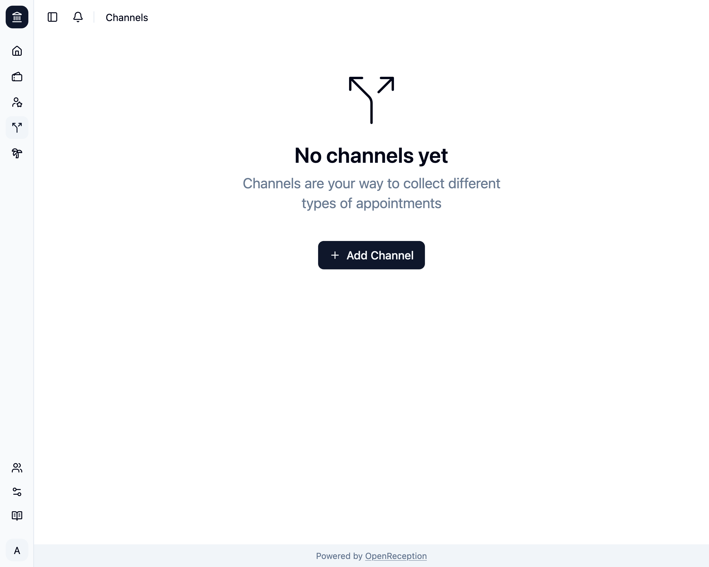

import {Steps} from "@astrojs/starlight/components";

:::note
Vor dem Hinzufügen eines Kanals stelle sicher, dass Du [alle Mandanten-Sprachen konfiguriert hast](../../settings/base-settings).
:::

<Steps>

1. Navigiere zum Bereich Kanäle im Dashboard und klicke auf _Kanal hinzufügen_

   

1. Ein Modal mit einem Formular öffnet sich.
   - Füge einen **Namen** und eine **Beschreibung** in allen Deinen Sprachen hinzu
   - Wähle die **Akteure:innen** aus, die Termine in diesem Kanal durchführen können. Bei automatischer Wahl werden die Akteur:innen in der Reihenfolge der Auswahl gewählt.
   - Wähle die **Mitarbeiter:innen** aus, die Benachrichtigungen über diesen Kanal erhalten (für Terminanfragen).
   - Wähle, ob dieser Kanal **öffentlich** sein soll. Wenn er nicht öffentlich ist, kannst nur Du Termine über den [Kalender](/de/calendar) buchen.
   - Wähle, ob Termine einer **Bestätigung bedürfen**. Du wirst [vom Benachrichtigungssystem benachrichtigt](/de/staff/notifications), wenn eine neue Anfrage hinzugefügt wird.
   - Füge einen **Zeitplan** für Deine Termine hinzu. Siehe [Zeitvorlagen](../#zeitvorlagen).

   

1. Klicke dann auf _Kanal hinzufügen_ damit er gespeichert wird.
   

</Steps>
