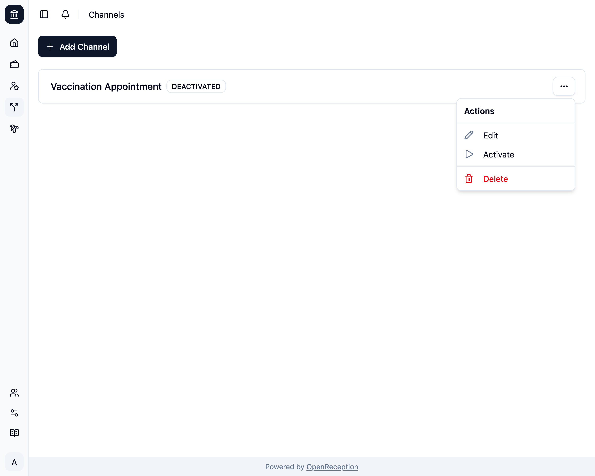
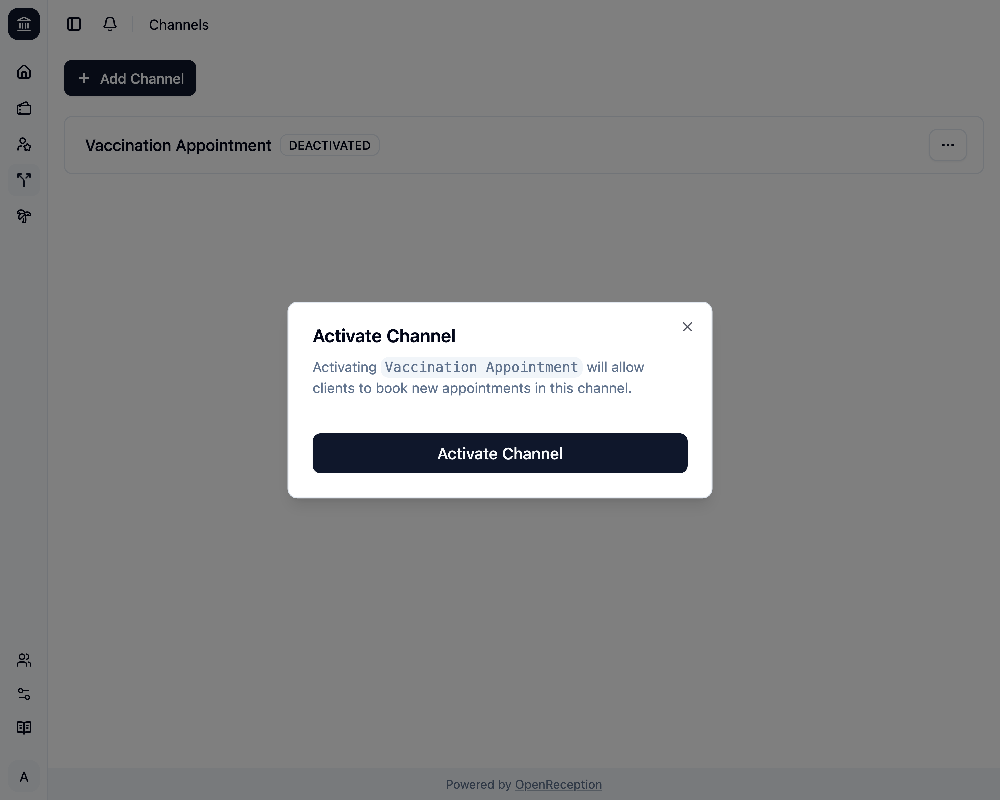
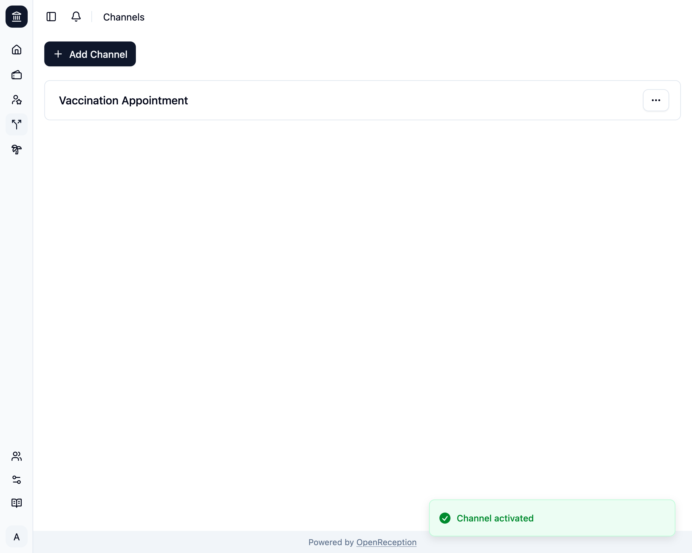
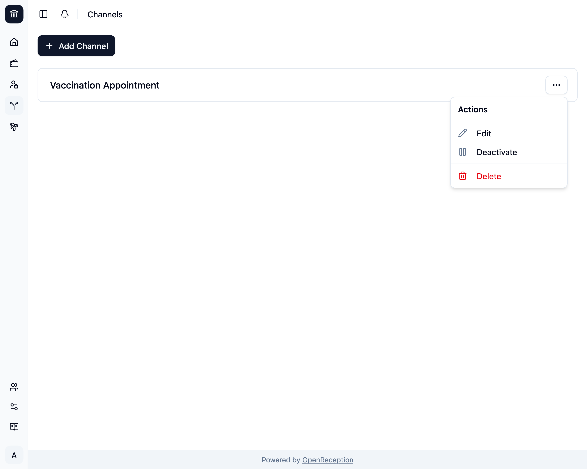

import {Steps} from "@astrojs/starlight/components";

Wenn Du keine neuen Termine in einem Kanal annehmen möchtest, kannst Du ihn deaktivieren.

:::note
Diese Seite zeigt, wie man einen Kanal aktiviert. Derselbe Prozess gilt auch für das Deaktivieren eines Kanals.
:::

<Steps>

1. Navigiere zum Bereich Kanäle im Dashboard, suche nach dem Kanal, den Du aktivieren/deaktivieren möchtest, und öffne das Kontextmenü. Klicke auf _Aktivieren_.

   

1. Ein Modal öffnet sich. Klicke auf _Kanal aktivieren_

   

1. Der Kanal wird aktiviert. Er wird wieder in der Kanalliste zum [Buchen von Terminen](/de/client-side/book-appointment) angezeigt.

   

</Steps>

Du kannst jetzt denselben Prozess ausführen, um den Kanal zu deaktivieren.

