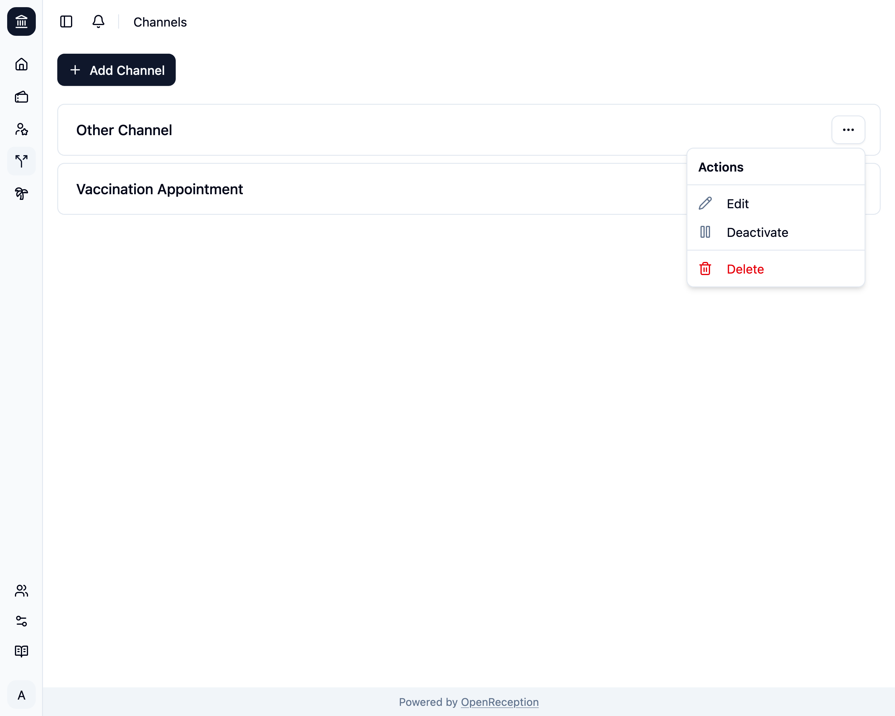
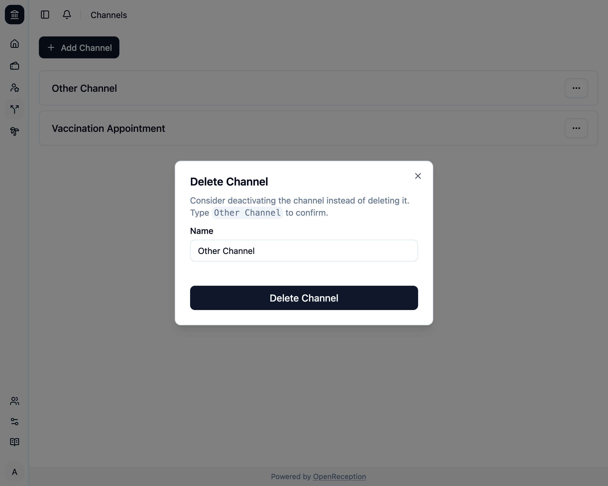
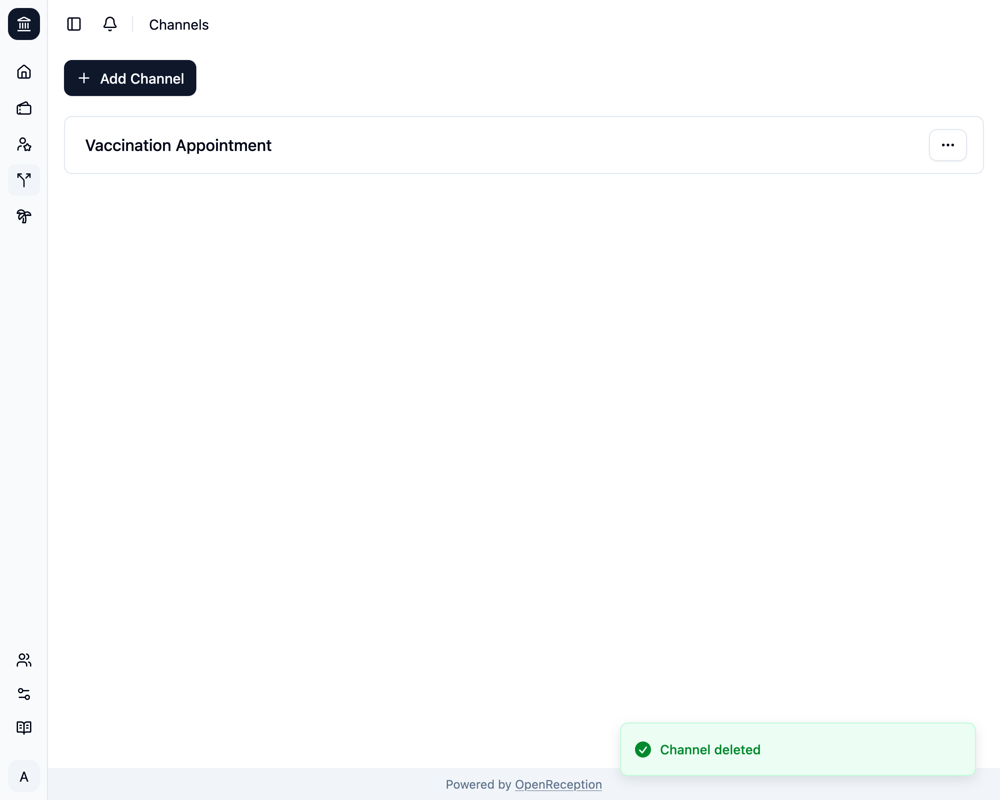

import {Steps} from "@astrojs/starlight/components";

:::danger
Wenn Du einen Kanal löschst, verschwinden damit auch alle Termine in diesem Kanel. Der Vorgang kann nicht rückgängig gemacht werden.
:::

<Steps>

1. Navigiere zum Bereich Kanäle im Dashboard, suche nach dem Kanal, den Du löschen möchtest, und öffne das Kontextmenü. Klicke auf _Löschen_.

   

1. Ein Modal mit einem Formular öffnet sich. Gib den Namen des Kanals ein und klicke auf _Kanal löschen_

   

1. Der Kanal wird entfernt.

   

</Steps>
