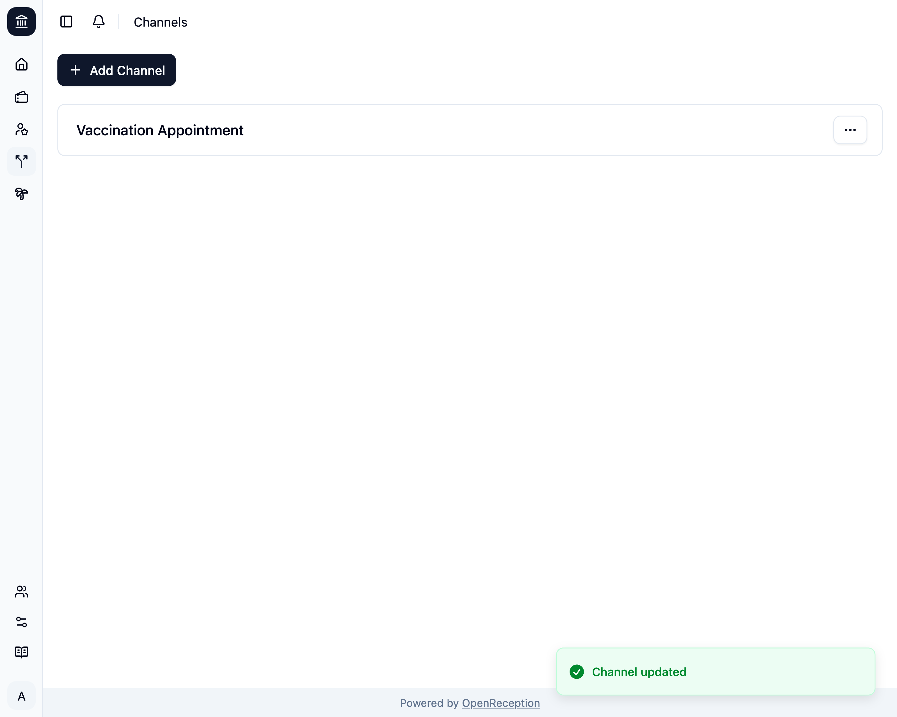

import {Steps} from "@astrojs/starlight/components";

:::note
Wenn Du Beschreibungen verwendest und Sprachen hinzugefügt hast, seit Du einen Kanal zuletzt bearbeitet hast, kannst Du Deine Änderungen nur speichern, wenn Du Beschreibungen in allen fehlenden Sprachen hinzufügst.
:::

<Steps>

1. Navigiere zum Bereich Kanäle im Dashboard, suche nach dem Kanal, den Du bearbeiten möchtest, und öffne das Kontextmenü. Klicke auf _Bearbeiten_.

   

1. Ein Modal mit einem Formular öffnet sich.
   - Bearbeite den **Namen** und die **Beschreibung** in allen Deinen Sprachen, wenn Du möchtest
   - Ändere die Auswahl der **Akteure:innen**, die Termine in diesem Kanal durchführen können. Bei automatischer Wahl werden die Akteur:innen in der Reihenfolge der Auswahl gewählt.
   - Ändere die Auswahl der **Mitarbeiter:innen**, die Benachrichtigungen über diesen Kanal erhalten (für Terminanfragen).
   - Ändere, ob dieser Kanal **öffentlich** sein soll. Wenn er nicht öffentlich ist, kannst nur Du Termine über den [Kalender](/de/calendar) buchen
   - Ändere, ob Termine **Bestätigung erforderlich** haben. Du wirst [vom Benachrichtigungssystem benachrichtigt](/de/staff/notifications), wenn eine neue Anfrage hinzugefügt wird.
   - Ändere die **Zeitvorlagen** für diesen Kanal, wenn Du möchtest. Siehe [Zeitvorlagen](/de/channels/#zeitvorlagen).
   - Klicke _Übernehmen_

   

1. Der Kanal wird aktualisiert.

   

</Steps>
