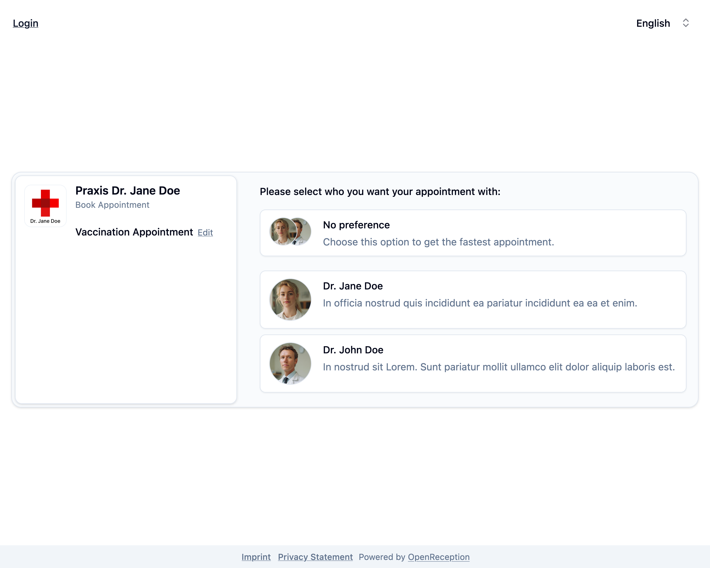

import {Steps} from "@astrojs/starlight/components";

Diese Schritt-für-Schritt-Anleitung zeigt Dir, wie Du einen Termin in OpenReception buchst.

:::note
Einige Termintypen können nicht direkt gebucht werden. Diese müssen erst angefragt werden. Eine Mitarbeiter:in wird Deine Anfrage später [bestätigen](/de/calendar/confirm-appointment) oder [ablehnen](/de/calendar/deny-appointment).
:::

<Steps>

1.  Navigiere zur Terminbuchungsseite der Organisation und klicke auf _Termin buchen_.

    

1.  Wähle den Termintyp, den Du möchtest (intern nennen wir diese Kanäle).

    

1.  Wähle die Person, bei der Du einen Termin haben möchtest. Dieser Schritt entfällt, wenn nur eine Person für diesen Termintyp verfügbar ist.

    

1.  Wähle ein verfügbares **Datum** und eine verfügbare **Uhrzeit** für Deinen Termin.

    

1.  Füge Deine persönlichen Daten hinzu.
    - Füge Deinen **Namen** hinzu.
    - Füge Deine **E-Mail-Adresse** hinzu.
    - Aktiviere das Häckchen unter dem E-Mail-Feld, um **über Änderungen benachrichtigt** zu werden. Wenn Du dies nicht aktivierst, musst Du Dich [anmelden](/de/client-side/client-dashboard), um nach Änderungen zu schauen.
    - Füge Deine **Telefonnummer** hinzu. Die Organisation kann verlangen, dass Du Deine Telefonnummer hier hinzufügst.
    - Klicke _Daten hinzufügen_, um fortzufahren.

    

1.  Wenn Du hier bereits einen Termin gebucht hast, wähle den Tab _Anmelden_ oben.

    

1.  Gib' Deine PIN ein und klicke _Zusammenfassung anzeigen_

1.  Wenn Du angemeldet bist und Deine E-Mail-Adresse und PIN korrekt sind, siehst Du eine Benachrichtigung _Erfolgreich angemeldet_.

    

1.  Überprüfe die Termindetails. Klicke _Termin buchen_ oder _Termin anfragen_.

1.  Dein Termin ist nun gebucht/angefragt.

    
    

</Steps>

Du kannst Dich jetzt anmelden, um den aktuellen Status Deines Termins zu sehen.
