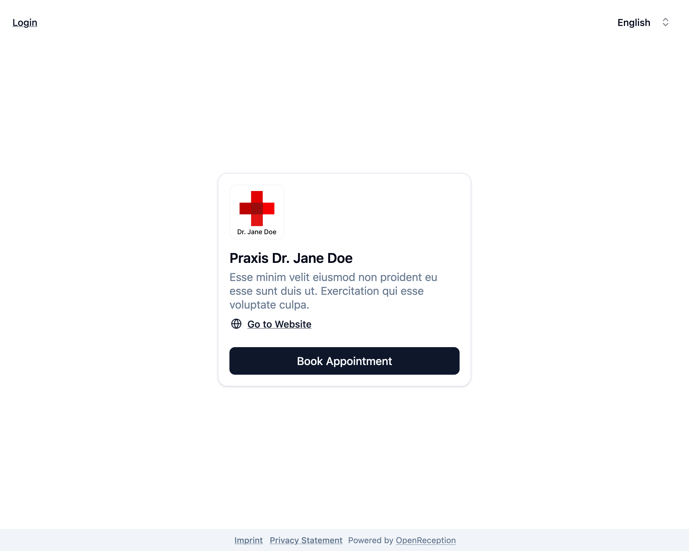
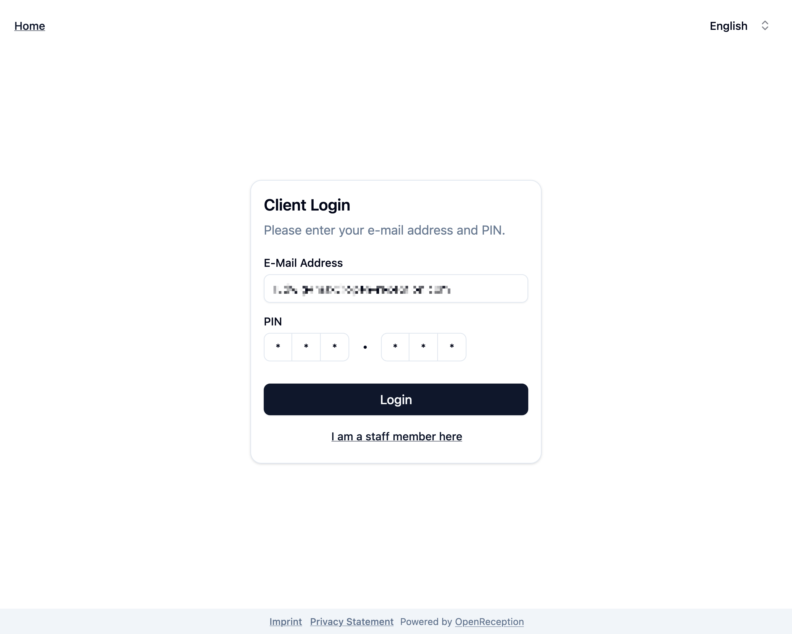
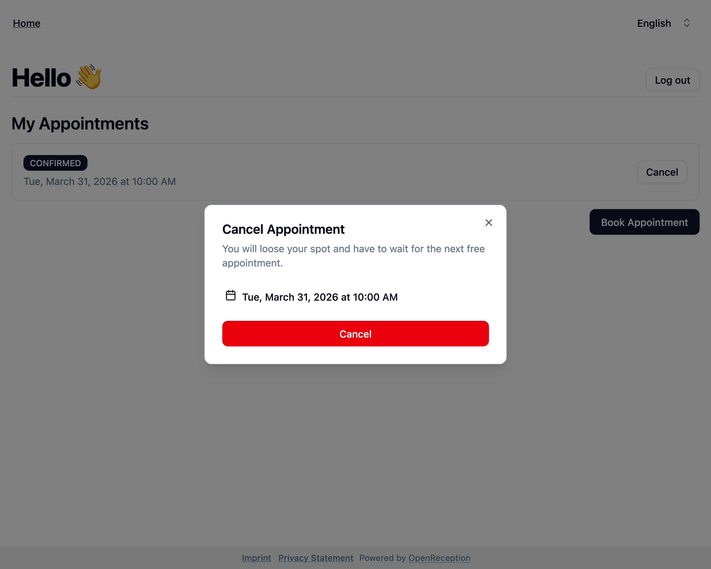

import {Steps} from "@astrojs/starlight/components";

Diese Seite führt Dich durch alle Dashboard-Funktionen auf Klienten-Seite.

## Anmelden

<Steps>

1.  Navigiere zur Terminbuchungsseite der Organisation und klicke _Anmelden_ in der linken oberen Ecke.

    

1.  Gib' Deine **E-Mail-Adresse** und Deine **PIN** ein. Klicke _Anmelden_.

    

1.  Wenn Deine Anmeldedaten korrekt sind, wirst Du zum Klienten-Dashboard weitergeleitet.

    

</Steps>

## Dashboard-Übersicht

Im Klienten-Dashboard siehst Du alle Deine zukünftigen Termine.

Du kannst Dich auch sicher abmelden.

## Termin absagen

Du kannst zukünftige Termine über das Klienten-Dashboard absagen.

<Steps>

1.  Navigiere zu Deinem Klienten-Dashboard. Suche nach dem Termin, den Du absagen möchtest, und klicke _Absagen_ auf seiner Karte.

    

1.  Es öffnet sich ein Modal. Klicke _Absagen_, um zu bestätigen.

    

1.  Dein Termin ist nun abgesagt und wird aus der Liste entfernt.

    

</Steps>
