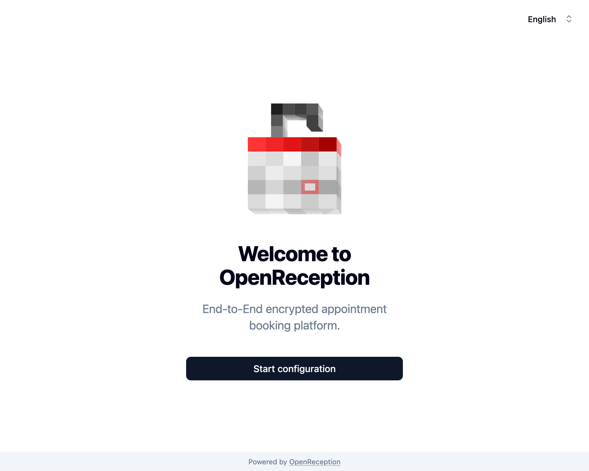
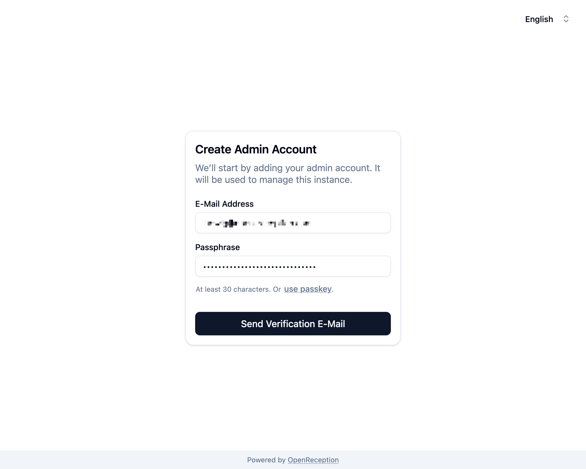
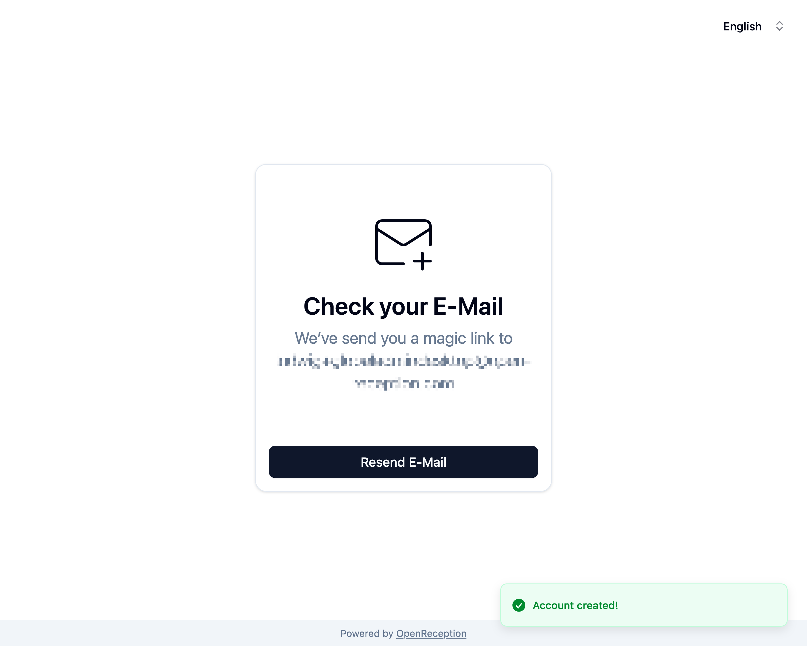

import {Steps} from "@astrojs/starlight/components";
import {Badge} from "@astrojs/starlight/components";

<Badge text="Management-Feature" />
Den Besitz einer neu eingerichteten Instanz zu übernehmen gibt Dir globalen
Admin-Zugriff. Du kannst Mandanten und ihre Daten verwalten, allerdings keine
Termine.

## Eine frisch installierte Instanz sichern

Dieser Vorgang muss einmal durchgeführt werden, bevor die reguläre Einrichtung von Mandanten fortgesetzt werden kann.

:::danger
Du solltest Deine Instanz so bald wie möglich in Besitz nehmen. Jeder mit Zugriff auf die Domain kann sich globalen Admin-Zugriff sichern. Der einfachste Weg, jemanden zu entfernen, der sich fälschlicherweise Zugriff verschafft hat, ist das Zurücksetzen des gesamten Systems/der Datenbank.
:::

<Steps>

1. Navigiere zur Domain, die Dir gegeben wurde/die Du selbst als Admin-Domain gesetzt hast. Du wirst zum Einrichtungsassistenten weitergeleitet, wenn Deine Instanz noch nicht in Besitz genommen wurde. Drücke _Konfiguration starten_, um fortzufahren.
   

1. Füge Deine E-Mail-Adresse und Deinen Passkey (oder Passphrase) ein und klicke auf _Bestätigungsmail senden_
   :::note
   Nur globale Admins können Passphrasen verwenden.
   :::

   

1. Sobald Dein Konto erstellt ist, wirst Du aufgefordert, Deine E-Mail-Adresse zu überprüfen.
   

1. Du erhältst eine E-Mail mit folgendem Inhalt. Klicke auf die Schaltfläche oder öffne die URL in einem Browser.

   ```
   Hallo Admin,

   willkommen auf unserer Terminbuchungsplattform. Bitte bestätige Deine E-Mail-Adresse.

   [E-Mail-Adresse bestätigen]

   Schaltfläche funktioniert nicht? Öffne diese URL in Deinem Browser:
   https://link-to-your-instance/confirm/token

   Dieser Link ist nur 10 Minuten lang gültig und kann nur einmal verwendet werden.

   Du erhältst diese E-Mail, weil jemand mit Deiner E-Mail-Adresse ein Konto registriert hat.
   ```

   Falls dies länger als 10 Minuten dauert, kannst Du die E-Mail erneut senden, nachdem Du den Link geöffnet hast.

1. Im Browser siehst Du eine Erfolgsmeldung. Klicke auf _Ersten Mandanten anlegen_, um fortzufahren.

   

   Falls es länger als 10 Minuten dauerte, auf diesen Link zu klicken, oder das Token ist falsch, siehst Du eine Fehlermeldung und kannst auf _E-Mail erneut senden_ klicken. Dies löst eine neue E-Mail mit einem neuen Token aus und Du kannst es erneut versuchen.

   

1. Jetzt kannst Du Dich mit Deinen neu erstellten Anmeldedaten anmelden.
   

1. Nach der Anmeldung wirst Du aufgefordert, den ersten Mandanten zu erstellen.
   

</Steps>
