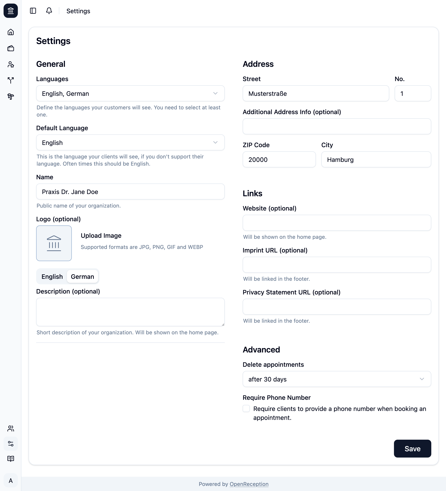

import {Steps} from "@astrojs/starlight/components";

:::caution
Wenn Du Sprachen hinzufügst, nachdem Du die Beschreibung Deiner Organisation (im gleichen Formular), Akteure:innen oder Kanäle eingerichtet hast, solltest Du diese erneut aufrufen, um die fehlenden Übersetzungen hinzuzufügen.
:::

<Steps>

1. Wenn Du zum Einstellungsbereich des Dashboards navigierst, siehst Du automatisch das Einstellungsformular.

1. Du kannst die folgenden Grundeinstellungen für Deine öffentliche Terminbuchungsseite vornehmen:
   - Ändere die **unterstützten Sprachen**
   - Lege die **Standardsprache** fest
   - Lege den **Namen Deiner Organisation** fest
   - Lade ein **Bild/Logo** hoch
   - Füge eine **Beschreibung für Deine Organisation** hinzu
   - Füge eine **Adresse** für Deine Organisation hinzu (sie wird in Bestätigungsmails angezeigt)
   - Füge **Links** zu Website, Impressum oder Datenschutzerklärung hinzu
   - Lege fest, **wann vergangene Termine gelöscht werden sollen**
   - Verlange von Klient:innen, ihre **Telefonnummer** zum Termin hinzuzufügen

   

1. Klicke _Speichern_, um Deine Änderungen zu übernehmen.

   Wenn Du gerade Deine Terminbuchungsseite einrichtest, siehst Du zusätzliche blaue Benachrichtigungen, die Dich durch diesen Prozess führen.

   

</Steps>
