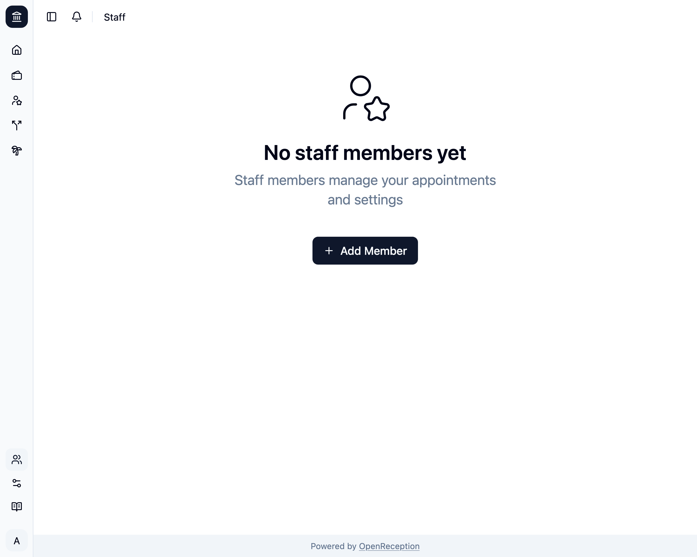
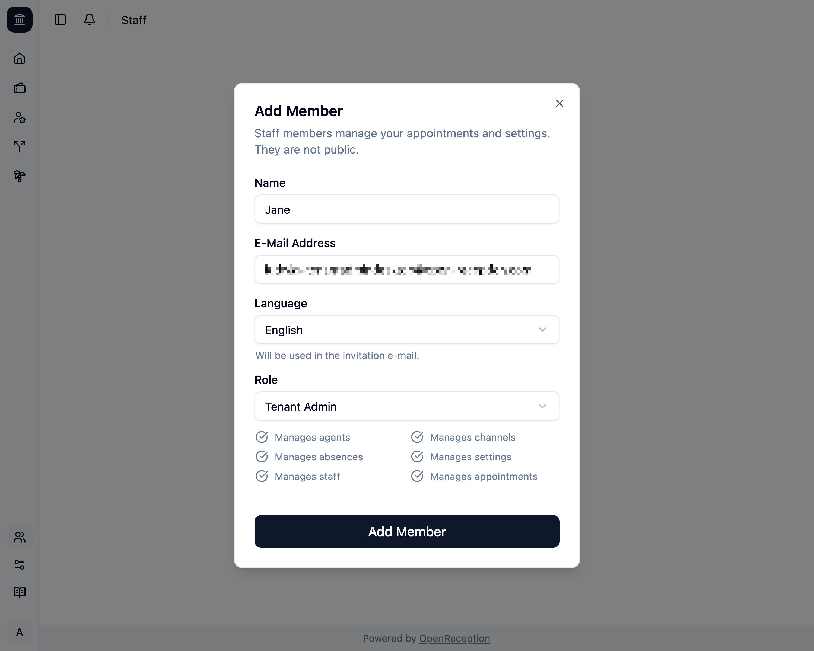
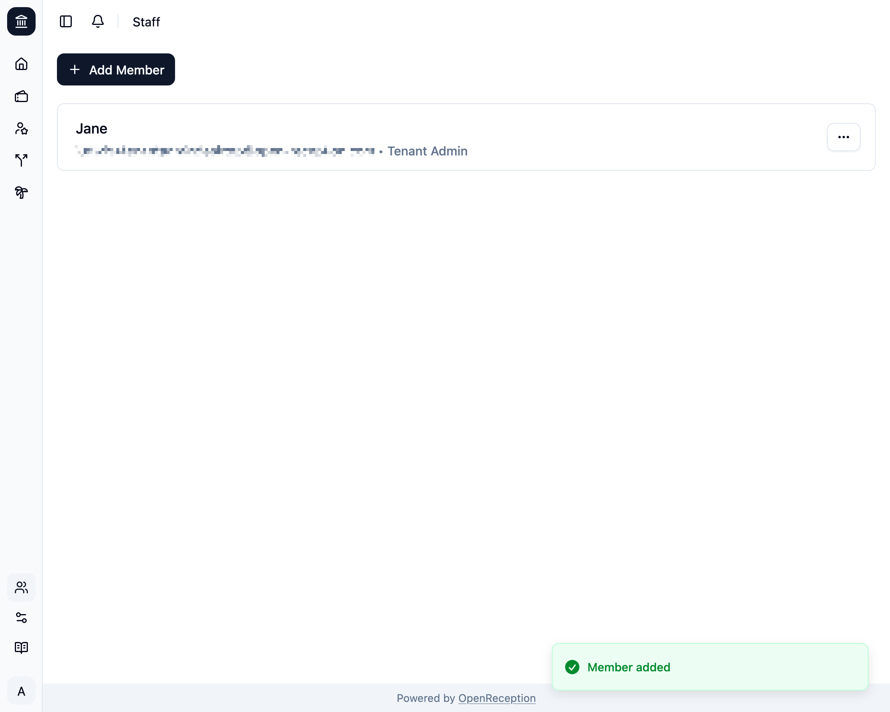

import {Steps} from "@astrojs/starlight/components";

Bevor Du eine Mitarbeiter:in hinzufügst, entscheide, welche [Rolle](/de/staff#rollen) diese Mitarbeiter:in haben soll.

:::note
In diesem Bereich kannst Du keine Konten mit der Rolle Global-Admin hinzufügen.
:::

<Steps>

1. Navigiere zum Bereich Mitarbeiter:innen im Dashboard und klicke auf _Mitarbeiter:in hinzufügen_

   

1. Es öffnet sich ein Modal mit einem Formular.
   - Füge einen **Namen** hinzu
   - Füge eine **E-Mail-Adresse** hinzu.
   - Ändere die **Sprache**, falls gewünscht.
   - Lege die **Rolle** für dieses Konto fest.

   

1. Klicke dann auf _Mitarbeiter:in_ und das neue Konto wird angelegt.
   

1. Die neue Mitarbeiter:in erhält eine E-Mail mit einem ablaufenden Bestätigungscode. Sie kann einen aktualisierten Code anfordern, wenn sie nicht schnell genug ist.

</Steps>

## Abschluss des Mitarbeiter:innen-Onboardings

Wenn Du bereits Termine in Deiner Instanz hast, musst Du dieser neuen Person Zugriff auf diese gewähren. Folge dafür diesem Prozess:

<Steps>

1. Die [neue Mitarbeiter:in muss ihr Konto einrichten](/de/account/setup-account).

1. Eine Person mit vollem Zugriff muss der neuen Mitarbeiter:in [Zugriff gewähren](/de/staff/grant-access-to-staff-member).

</Steps>
