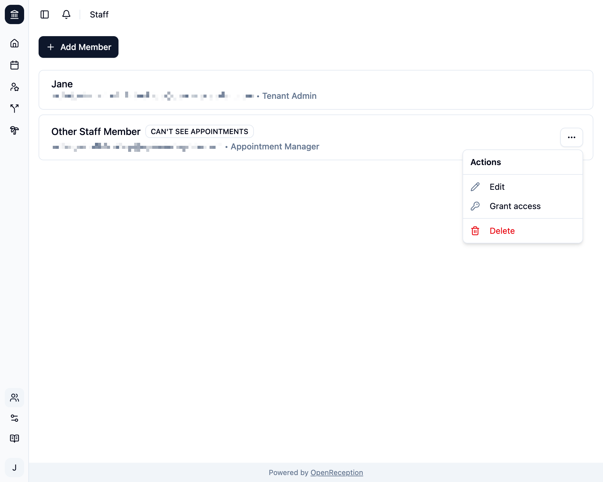
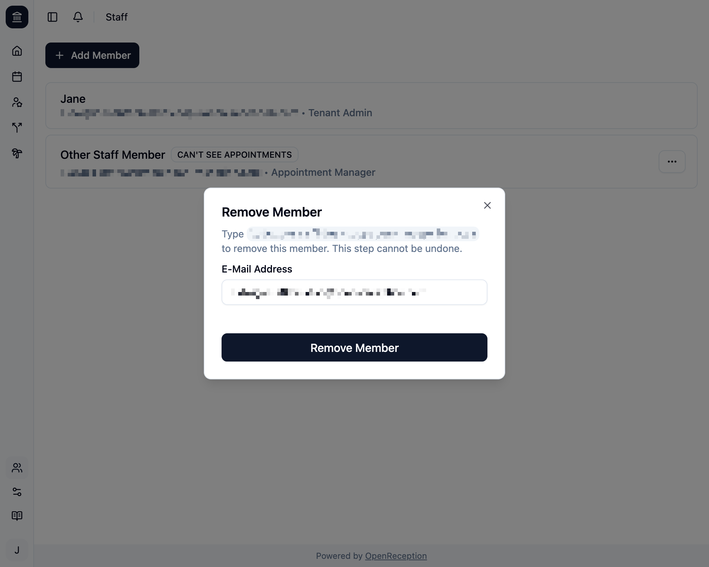
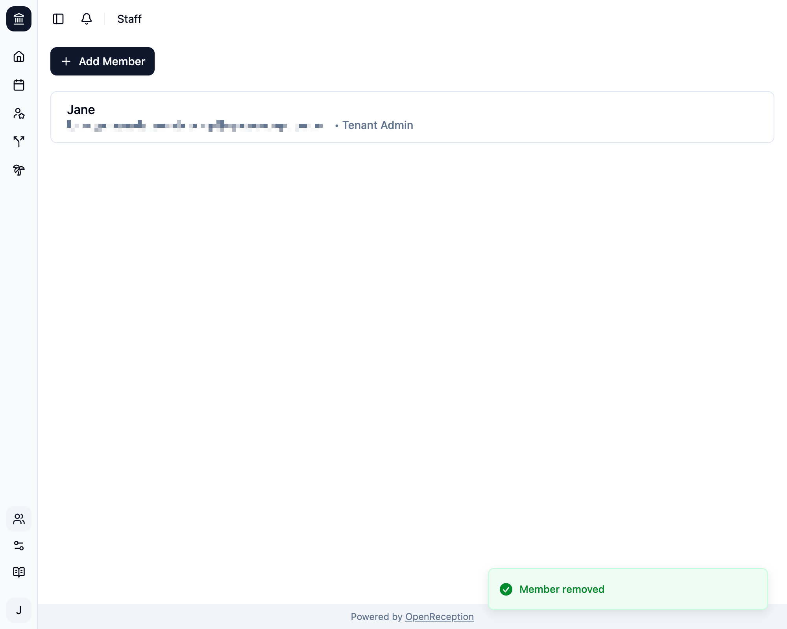

import {Steps} from "@astrojs/starlight/components";

:::danger
Sei vorsichtig beim Entfernen von Mitarbeiter:innen. Diese Aktion kann nicht rückgängig gemacht werden.
:::

:::note
Du kannst nicht die letzte Mitarbeiter:in mit vollständiger Termineinsicht entfernen.
:::

<Steps>

1. Navigiere zum Bereich Mitarbeiter:innen im Dashboard, suche die Mitarbeiter:in, die Du aus dem System löschen möchtest, und öffne das Kontextmenü. Klicke auf _Löschen_.

   

1. Es öffnet sich ein Modal mit einem Formular. Gebe den Namen der Mitarbeiter:in ein und klicke _Konto entfernen_

   

1. Das Konto wird entfernt.

   

</Steps>
