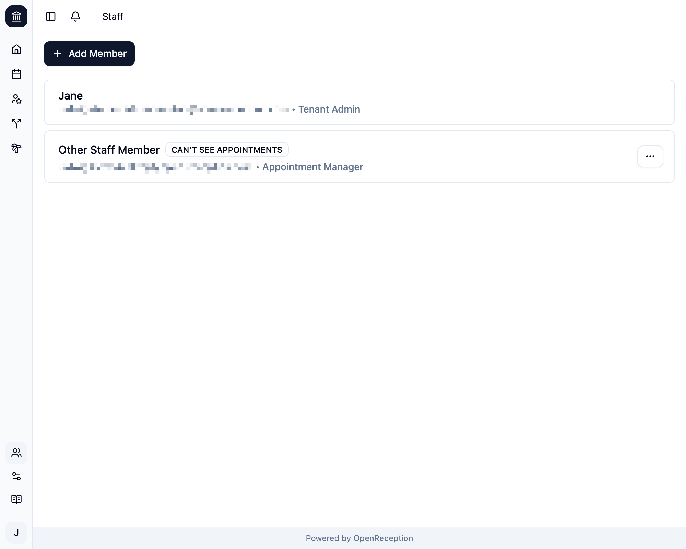
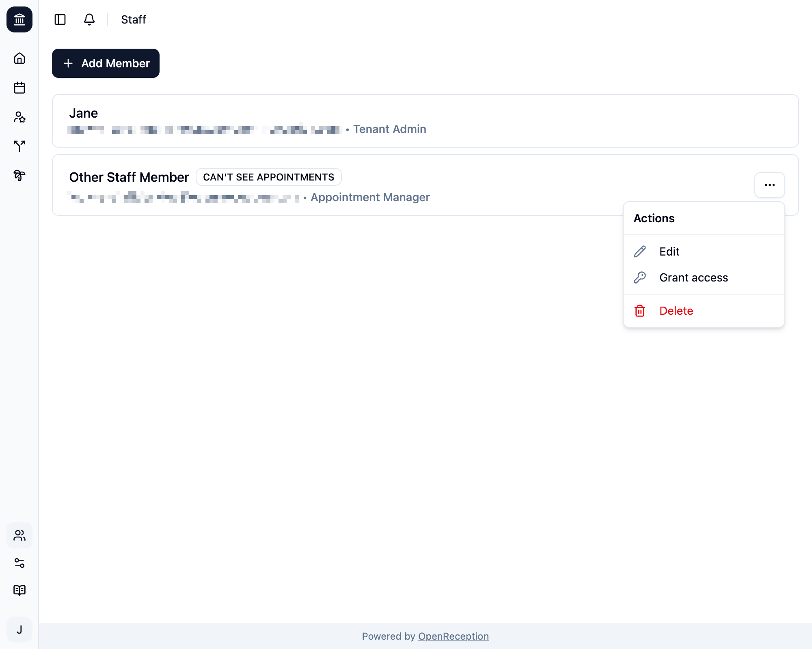
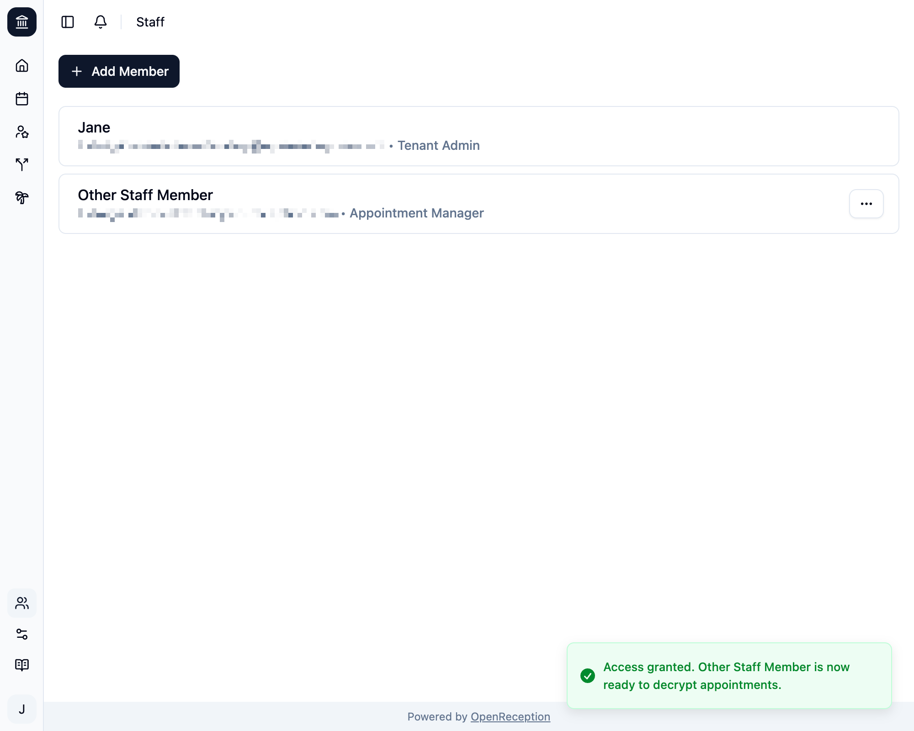

import {Steps} from "@astrojs/starlight/components";

:::note
Bevor Du einer Mitarbeiter:in Zugriff gewähren kannst, muss diese [ihr Konto einrichten](/de/account/setup-account).
:::

:::tip
Nur Mitarbeiter:innen, die bereits vollständigen Zugriff haben, können diesen anderen gewähren.
:::

<Steps>

1. Navigiere zum Bereich Mitarbeiter:innen im Dashboard und suche die Mitarbeiter:in, der Du Zugriff gewähren möchtest. Es wird ein Badge `KANN TERMINE NICHT SEHEN` angezeigt.

   

1. Öffne das Kontextmenü für diese Mitarbeiter:in und klicke _Zugriff gewähren_.

   

1. Es öffnet sich ein Modal. Bestätige durch Klicken auf _Zugriff gewähren_.
   

1. Wenn erfolgreich, schließt sich das Modal, Du siehst eine Erfolgsmitteilung und das Badge `KANN TERMINE NICHT SEHEN` verschwindet.

   

   Wenn dieser Prozess fehlschlägt, wird Dir eine Fehlermeldung angezeigt. Du kannst es jederzeit wiederholen. Möglicherweise wird Dir dieser Fehler angezeigt, wenn die Mitarbeiter:in ihr Konto nicht eingerichtet hat.

   

   Wenn dies weiterhin geschieht, kannst Du evtl. [den Support kontaktieren](https://open-reception.com/de/support).

</Steps>
