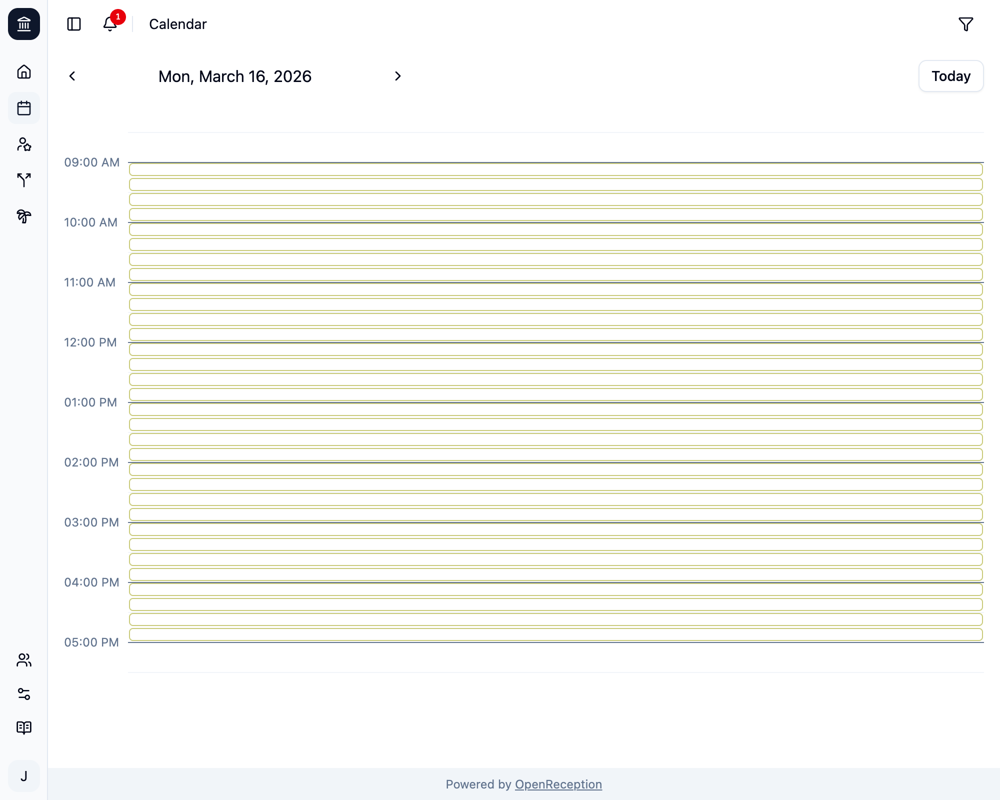

Das OpenReception-Benachrichtigungssystem stellt sicher, dass Mitarbeiter:innen benachrichtigt werden, wenn eine Klient:in einen Termin anfragt oder Termine abgesagt werden.

Nur Mitarbeiter:innen erhalten Benachrichtigungen.

Benachrichtigungen existieren nur innerhalb des OpenReception-Dashboards.

## Benachrichtigungen abonnieren

Um Benachrichtigungen zu erhalten, musst Du die entsprechende Mitarbeiter:in zum [Kanal](/de/channels) hinzufügen.

## Aktive Benachrichtigungen

Wenn Du Benachrichtigungen hast, erscheint ein rotes Badge neben dem Glockensymbol im oberen linken Bereich der Dashboard-Seite.

Wenn Du auf das Glockensymbol klickst, öffnet sich die Benachrichtigungsliste.

- Du kannst einzelne Benachrichtigungen entfernen, indem Du auf das Häkchen-Symbol auf der rechten Seite der Benachrichtigung klickst.
- Du kannst alle Benachrichtigungen entfernen, indem Du auf das Doppel-Häkchen-Symbol klickst.
- Du kannst die Benachrichtigungsliste schließen, indem Du auf das Kreuzsymbol klickst.

Einige Benachrichtigungen erlauben Dir, darauf zu klicken. Du wirst zur entsprechenden Seite/Termin weitergeleitet.
