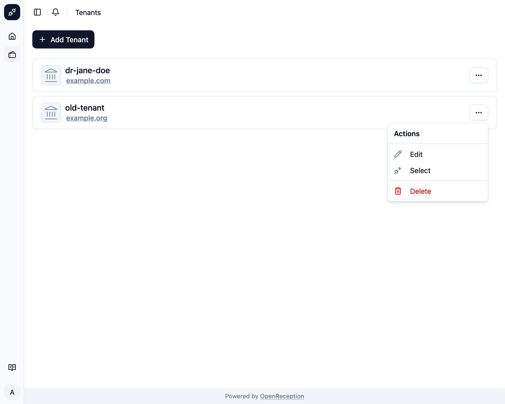
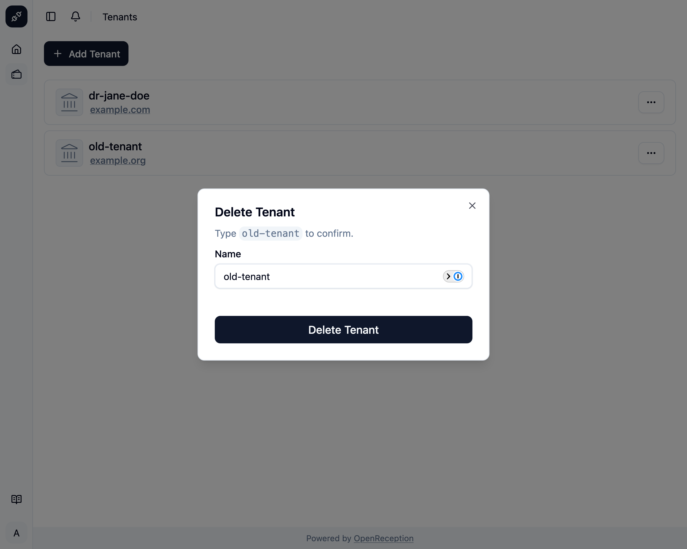

import {Steps} from "@astrojs/starlight/components";
import {Badge} from "@astrojs/starlight/components";

<Badge text="Management-Feature" />
Wenn Du einen Mandanten nicht mehr benötigst, kannst Du ihn löschen.

:::danger
Das Löschen eines Mandanten wird alle Konfigurationen und Termine entfernen. Dies kann nicht rückgängig gemacht werden.
:::

:::caution
Du kannst keinen Mandanten löschen, den Du derzeit ausgewählt hast. Wähle zuerst einen anderen Mandanten.
:::

<Steps>

1. Navigiere zum Mandanten-Bereich des Dashboards, suche den Mandanten, den Du löschen möchtest, und öffne das Kontextmenü dafür. Klicke auf _Löschen_.

   

1. Es öffnet sich ein Modal mit einem Formular. Gebe den Namen des Mandanten ein und klicke _Mandant löschen_

   

1. Der Mandant wird gelöscht und aus der Liste entfernt.

   

</Steps>
