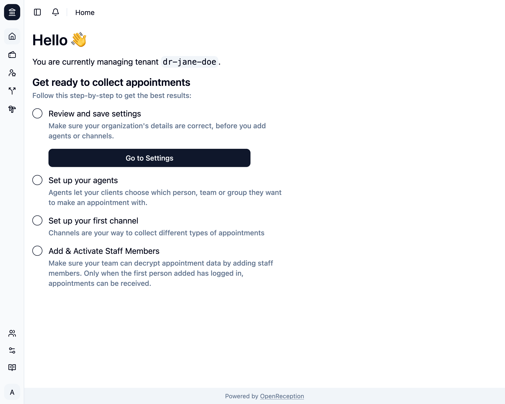

import {Badge} from "@astrojs/starlight/components";
import {Steps} from "@astrojs/starlight/components";

<Badge text="Management-Feature" />
Die Auswahl eines Mandanten bietet für Dich als Global Admin die Möglichkeit,
zwischen Mandanten zu wechseln.

<Steps>

1. Navigiere zum Mandanten-Bereich des Dashboards, suche den Mandanten, den Du auswählen möchtest, und öffne das Kontextmenü dafür. Klicke auf _Auswählen_.

   

1. Nachdem die Auswahl abgeschlossen ist, wirst Du zum Dashboard für diesen Mandanten weitergeleitet. In diesem Fall ist es ein neuer Mandant, der noch eingerichtet werden muss. Es gibt einen [Onboarding-Leitfaden, um Dir bei der Einrichtung dieses Mandanten zu helfen](../onboarding-a-tenant).

   

</Steps>

Du kannst Mandanten auch in der Auswahl oben links wählen, wenn Du mehr als einen hast.

