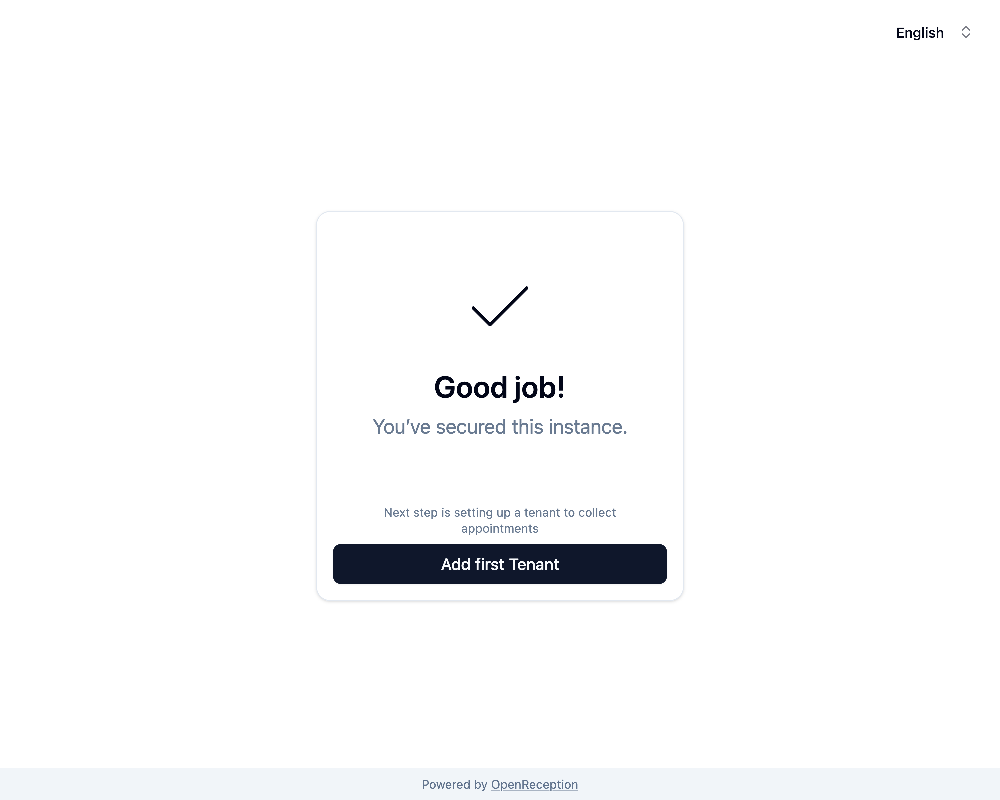
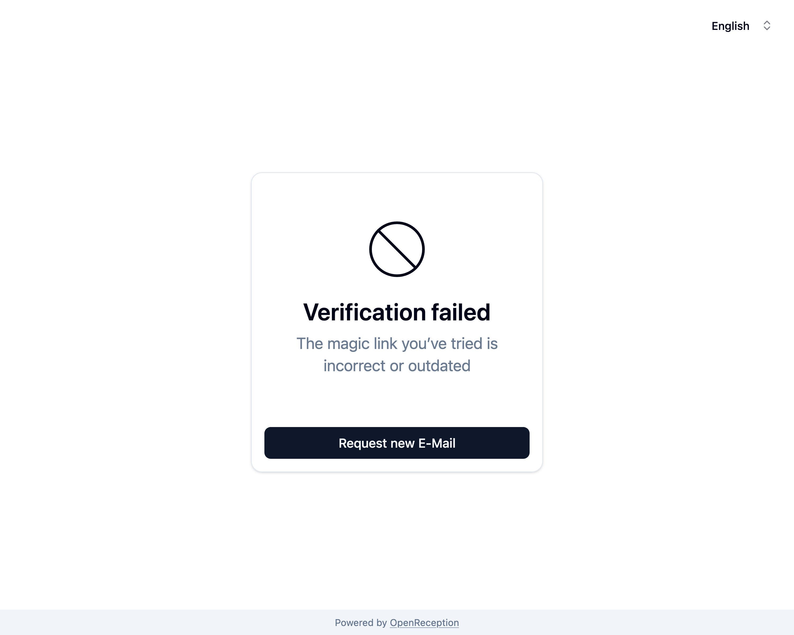
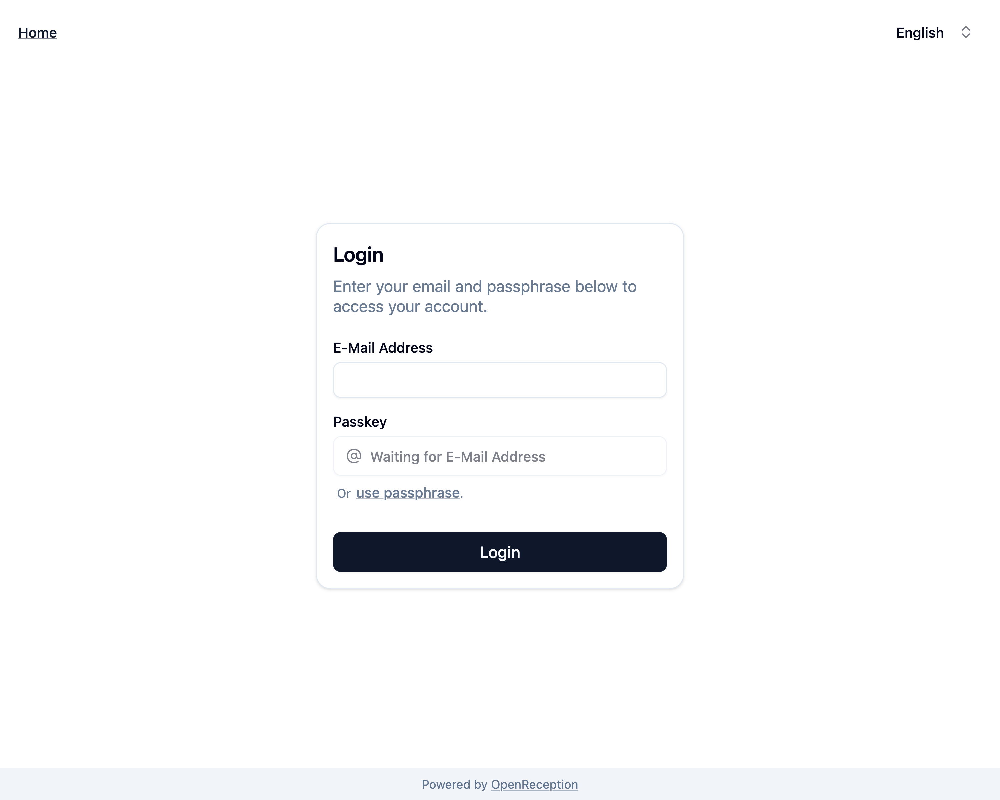
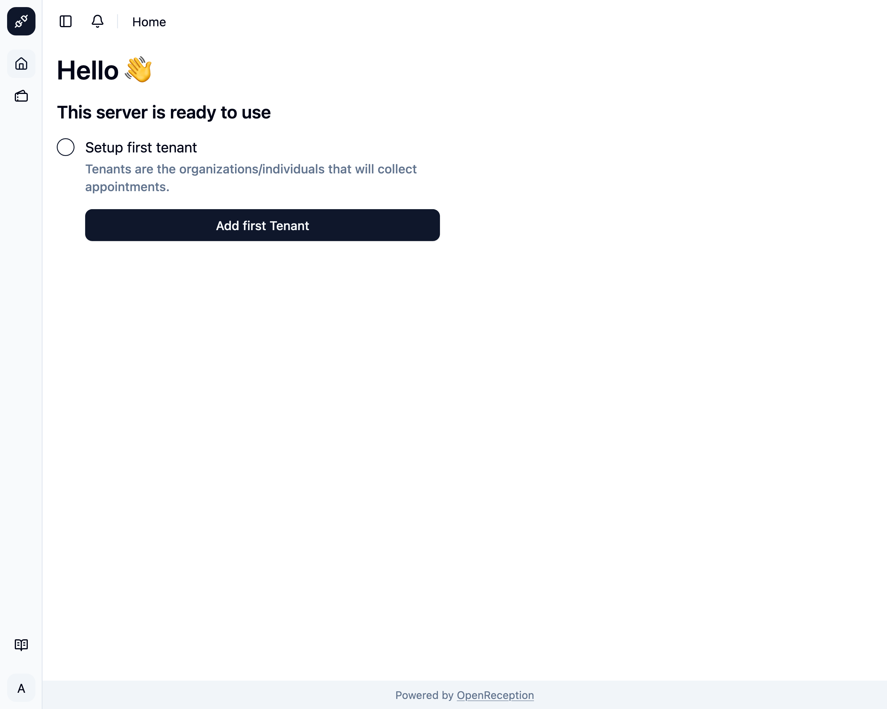

import {Steps} from "@astrojs/starlight/components";
import {Badge} from "@astrojs/starlight/components";

<Badge text="Management Feature" />
Claiming an instance gives you global admin access. You can manage tenants and
their data, except for appointments.

## Securing a freshly installed instance

This process has to be done once, before the regular setup of tenants can
proceed.

:::danger
You should claim your instance as soon as possible. Anyone with access to the domain, can claim global admin access. The easiest way to remove someone who falsly claimed access, is to reset the entire system/ database.
:::

<Steps>

1. Navigate to the domain you've been given/ set yourself as the admin domain. You will be forwarded to the setup guide, if your instance is not claimed yet. Press _Start configuration_ to proceed.
   

1. Add your E-Mail Address and Passkey (or Passphrase) an click _Send verification E-Mail_
   :::note
   Only Global Admins can use Passphrases.
   :::

   

1. Once your account is created you are asked to check your E-Mail Address.
   

1. You will receive an E-Mail with the following content. Click on the button or open the URL in a browser.

   ```
   Hello Admin,

   welcome our appointment booking platform. Please confirm your e-mail address.

   [Confirm E-Mail Address]

   Button not working? Open this URL into your browser:
   https://link-to-your-instance/confirm/token

   This link is only valid for 10 minutes and can only be used once.

   You are receiving this email because someone registered an account with your e-mail address.
   ```

   In case this takes longer than 10 minutes you will be able to resend an email, once you've opened the link.

1. Back in the browser you will see a success message. Click on _Add first Tenant_ to proceed.

   

   In case it took longer than 10 minutes to click this link or the token is incorrect, you will see an error and can click _Request new E-Mail_. This will trigger another E-Mai with a fresh token and you can try again.

   

1. Now you can use your newly created credentials to login.
   

1. Once logged-in you are prompted to create the first tenant.
   

</Steps>
