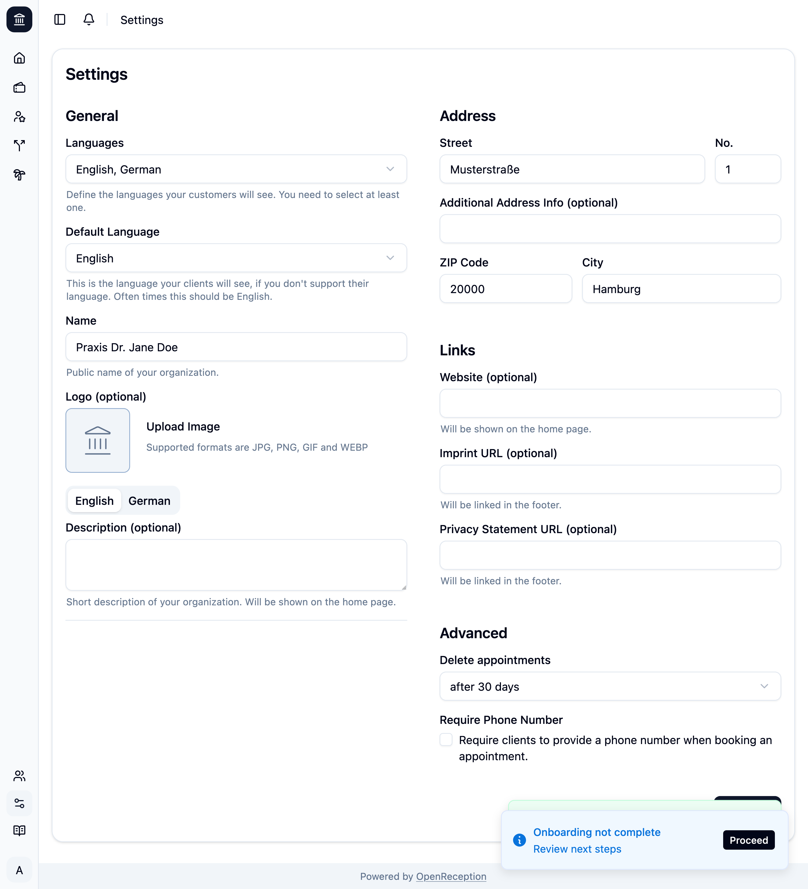

import {Steps} from "@astrojs/starlight/components";

:::caution
If you are adding languages after you've set up your organizations description (within the same settings form), agents or channels, you should revisit them to add the missing translations.
:::

<Steps>

1. When you navigate to the settings section of the dashboard, you automatically see the settings form.

1. You can make the following basic settings for your public facing appointment booking page:
   - Change the **supported languages**
   - Set the **default language**
   - Set the **name of your organization**
   - Upload an **image/ logo**
   - Add a **description for your organization**
   - Add an **address** for your organization (it will appear in confirmation e-mails)
   - Add **links** like website, imprint and privacy policy
   - Define **when past appointments should be deleted**
   - Require clients to add their **phone number** to the appointment

   

1. Click _Save_ to apply your changes.

   If you are currently onboarding your appointment booking page, you will see additional blue notifications that guide you through this process.

   

</Steps>
