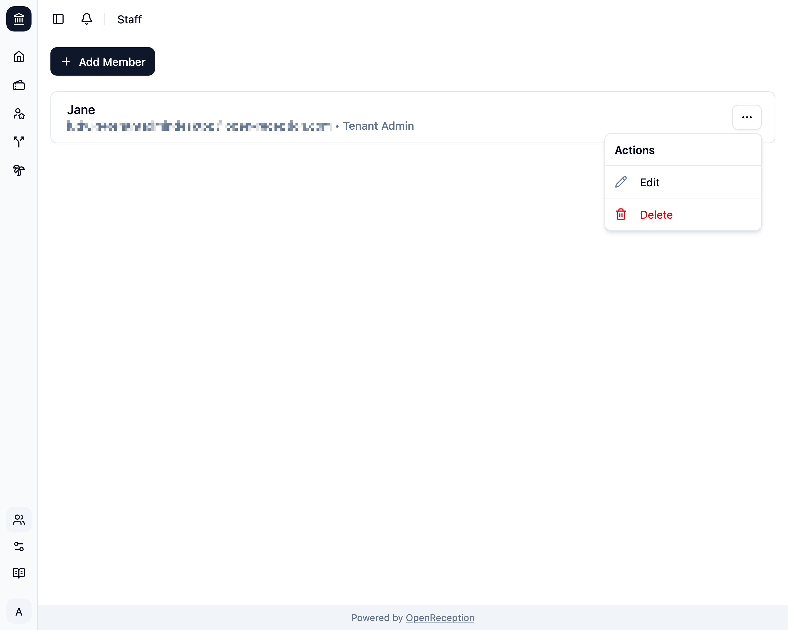
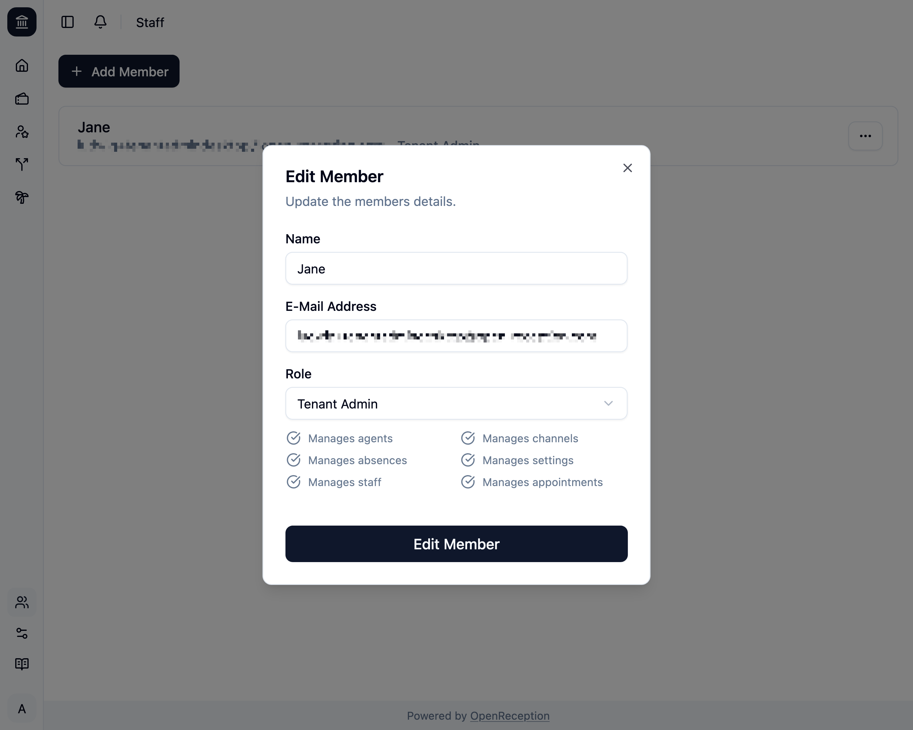
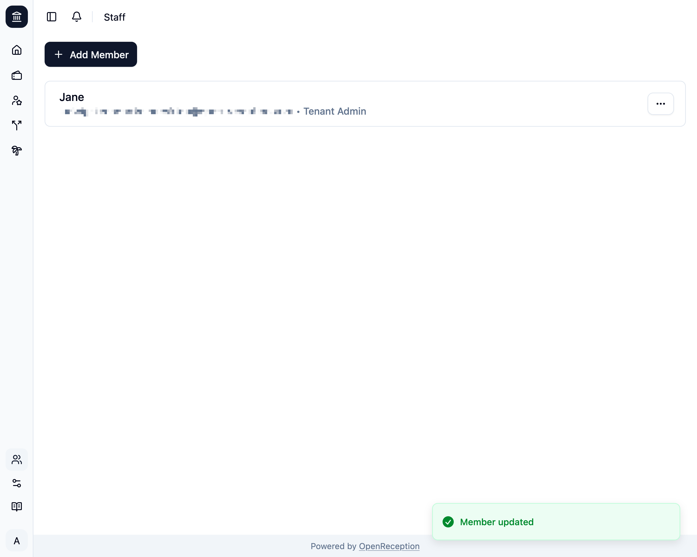

import {Steps} from "@astrojs/starlight/components";

<Steps>

1. Navigate to the staff member section of the dashboard, search for the member you want to edit and open the context menu for it. Click on _Edit_.

   

1. A modal with a form opens.
   - Edit the **name**, if you want.
   - Edit **e-mail address**, if you want.
   - Change the **role**, if you want.
   - Click _Edit Member_ when you are finished.

   

1. The staff member will be updated.

   

</Steps>
