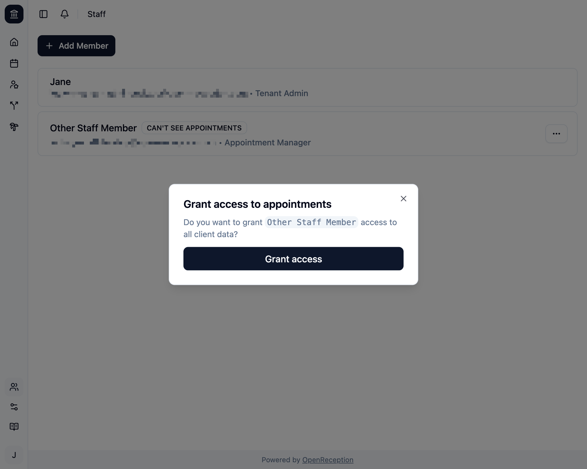
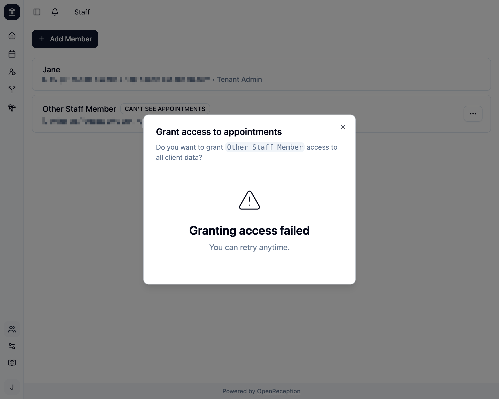

import {Steps} from "@astrojs/starlight/components";

:::note
Before you can grant access to a staff member they must have [setup their account](/account/setup-account).
:::

:::tip
Only staff members that already have full access, can grant their access to others.
:::

<Steps>

1. Navigate to the staff member section of the dashboard, search for the member you want to grant access to. It will show a badge `CAN'T SEE APPOINTMENTS`.

   

1. Open the context menu for this staff member and click _Grant access_.

   

1. A modal opens. Confirm by clicking _Grant Access_.
   

1. When successful the modal closes, you will see a success notification and the `CAN'T SEE APPOINTMENTS` badge will disappear.

   

   If this process fails, you will be shown an error message. You can retry anytime. You may see this error, if the staff member has not set up their account.

   

   If this keeps happening, you may [contact support](https://open-reception.com/support).

</Steps>
